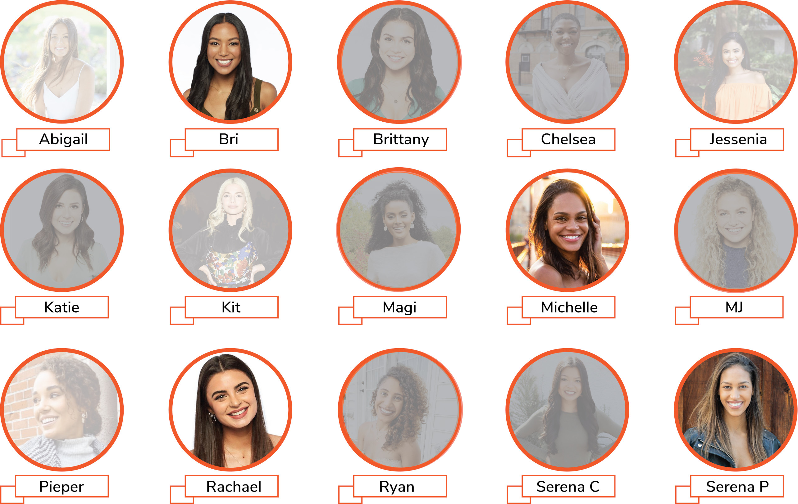

```{r setup, include=FALSE}
if (!require(pacman)) { install.packages("pacman"); library(pacman) }
p_load(knitr, tidyverse, lme4, sjstats, lmerTest, sjPlot, sjmisc, viridis)
knitr::opts_chunk$set(echo = TRUE) #print code by default
options(digits=3) 
```

## Motivating Example 

Let's say you are one of the many people of Bachelor Nation frustrated that *yet again* the producers have decided to delay the Rose Ceremony by a week. You've seen all the drama of week five, yet still do not know who Matt James will choose to send home.

As infuriating as the situation in which you find yourself is, you have one thing in your back pocket that can help get you through this waiting period: data. 

You have secret intel on how much Matt James likes (on a scale from 0 to 100) each of the remaining contestants. Matt has been rating each of the contestants along this dimension after each interaction (e.g., 1-1 date, group date, cocktail party, etc.). You just happened to have stumbled upon this log indicating his preferences (perhaps Reality Steve leaked it!), and now you'd like to use what information you know about his preferences to predict what will happen in next week's episode. 

*A few pieces of key information*

**The Bachelor:** <br/>

```{r, out.width = "400px", echo = FALSE}


```


**The remaining contestants:** <br/>


```{r, echo = FALSE}

abigail_log <- c(80, 75, # first impression rose
                 70, 75, # w2
                 79, 74,# w3
                 85, 80, #w4
                 69, 85)  #w5
abigail_PA <- c(7, 8, # first impression rose
                 6, 7, # w2
                 7, 6,# w3
                 7, 8, #w4
                 9, 8)  #w5


abigail_df <- data.frame(contestant = "Abigail", interactions = 1:length(abigail_log), like = abigail_log,PA = abigail_PA)
bri_log <- c(75, 80, #w1
             90, 86, 80, # w2- 1-1 
             79, 82, 
             76, 74, 
             73, 75) 
bri_PA <- c(6, 7, #w1
             8, 9, 7, # w2- 1-1 
             5, 6, 
             7, 6, 
             4, 6) 
bri_df <- data.frame(contestant = "Bri", interactions = 1:length(bri_log), like = bri_log, PA= bri_PA)

brittany_log <- c(85, # w4 arrival
                  87, 80)

brittany_PA <- c(8, # w4 arrival
                  2, 6)

brittany_df <- data.frame(contestant = "Brittany", interactions = 1:length(brittany_log), like = brittany_log, PA = brittany_PA)

chelsea_log <- c(70, 75, #
                 85, 80, # group date rose
                  76, 70,# w3
                  78, 83, #w4
                 74, 80)  #w5

chelsea_PA <- c(6, 7, #
                 8, 7, # group date rose
                  6, 7,# w3
                  5, 6, #w4
                 5, 7)  #w5
chelsea_df <- data.frame(contestant = "Chelsea", interactions = 1:length(chelsea_log), like = chelsea_log, PA = chelsea_PA)

jessenia_log <- c(60, 70, #
                 65, 55, # 
                  60, 63,# w3
                  69, 65, #w4
                  75, 73)  #w5

jessenia_PA <- c(6, 7, #
                 5, 6, # 
                  5, 7,# w3
                  6, 7, #w4
                  9, 8)  #w5
jessenia_df <- data.frame(contestant = "Jessenia", interactions = 1:length(jessenia_log), like = jessenia_log, PA = jessenia_PA)

katie_log <- c(75, 78, #w1
                 88, 84, # w2
                  75, 78,# w3
                  70, 80, #w4
                  76, 77)  #w5


katie_PA <- c(8, 9, #w1
                 8, 7, # w2
                  7, 8,# w3
                  7, 7, #w4
                  8, 7)  #w5
katie_df <- data.frame(contestant = "Katie", interactions = 1:length(katie_log), like = katie_log, PA = katie_PA)


kit_log <- c(65, 70, #w1
                 68, 72, # w2
                  73, 70,# w3
                  67, 70, #w4
                  80, 74)  #1-1

kit_PA <- c(5, 6, #w1
                 6, 7, # w2
                  7, 6,# w3
                  5, 7, #w4
                  4, 9)  #1-1
kit_df <- data.frame(contestant = "Kit", interactions = 1:length(kit_log), like = kit_log, PA = kit_PA)


magi_log <- c(60, 65, #w1
                 63, 68, # w2
                  64, 70,# w3
                  73, 69, #w4
                  72, 65)  #w5
magi_PA <- c(7, 8, #w1
                 7, 6, # w2
                  5, 6,# w3
                  5, 7, #w4
                  8, 7)  #w5


magi_df <- data.frame(contestant = "Magi", interactions = 1:length(magi_log), like = magi_log, PA = magi_PA)


michelle_log <- c(85, 90, 95, # w4 arrival
                  87, 93) # "falling in love"

michelle_PA <- c(9, 10, 8, # w4 arrival
                  6, 9) # "falling in love"

michelle_df <- data.frame(contestant = "Michelle", interactions = 1:length(michelle_log), like = michelle_log, PA = michelle_PA)


mj_log <- c(73, 76, #w1
                 72, 73, # w2
                  74, 70,# w3
                  55, 60, #w4
                  60, 50)  #w5

mj_PA <- c(7, 6, #w1
                 6, 5, # w2
                  4, 5,# w3
                  4, 6, #w4
                  7, 3)  #w5

mj_df <- data.frame(contestant = "MJ", interactions = 1:length(mj_log), like = mj_log, PA = mj_PA)


peiper_log <- c(80, 83, #w1
                 82, 79, # w2
                  74, 80,# w3
                  82, 83, #w4
                  80, 78)  #w5

peiper_PA <- c(7, 6, #w1
                 8, 6, # w2
                  7, 6,# w3
                  5, 7, #w4
                  8, 6)  #w5

peiper_df <- data.frame(contestant = "Peiper", interactions = 1:length(peiper_log), like = peiper_log, PA = peiper_PA)


rachael_log <- c(85, 80, #w1
                 82, 87, # w2 
                  88, 90,# w3 - group date rose
                  85, 83, #w4
                  90, 95, 93)  #w5 - 1 -1 and "falling in love"

rachael_PA <- c(7, 6, #w1
                 8, 6, # w2 
                  7, 10,# w3 - group date rose
                  8, 6, #w4
                  9, 10, 9)  #w5 - 1 -1 and "falling in love"
rachael_df <- data.frame(contestant = "Rachael", interactions = 1:length(rachael_log), like = rachael_log, PA = rachael_PA)


ryan_log <- c(70, # 
                  80, 75) # 

ryan_PA <- c(8, # 
                  3, 6) # 

ryan_df <- data.frame(contestant = "Ryan", interactions = 1:length(ryan_log), like = ryan_log, PA = ryan_PA)


serena_c_log <- c(50, 55, #w1
                 60, 55, # w2 
                  53, 52,# w3 
                  50, 57, #w4
                  60, 62)  #w5 
serena_c_PA <- c(4, 5, #w1
                 5, 3, # w2 
                  6, 7,# w3 
                  5, 4, #w4
                  4, 6)  #w5 
serena_c_df <- data.frame(contestant = "Serena_C", interactions = 1:length(serena_c_log), like = serena_c_log, PA = serena_c_PA)


serena_p_log <- c(70, 75, #w1
                 80, 78,# w2 - 1 -1 
                  85, 80, 73,# w3 
                  76, 73, #w4
                  72, 79)  #w5 

serena_p_PA <- c(6, 7, #w1
                 8, 7,# w2 - 1 -1 
                  8, 10, 7,# w3 
                  5, 4, #w4
                  6, 7)  #w5 
serena_p_df <- data.frame(contestant = "Serena_P", interactions = 1:length(serena_p_log), like = serena_p_log, PA = serena_p_PA)

df <- bind_rows(list(abigail_df, bri_df, brittany_df, chelsea_df,jessenia_df,
                     katie_df, kit_df, magi_df, michelle_df, mj_df,
                     peiper_df, rachael_df, ryan_df, serena_c_df, serena_p_df))

```

## Features of the data

So how can we best leverage this secret intel we have? How can we make the best prediction possible? 

Within this data set, we have multiple observations for each person, so it'd be great if we could use *all* of that information to inform the predictions.

We also know a few things about each person that could be informative (e.g., occupation, race, age, audience likability, Matt's attractiveness ratings). 

```{r, echo = FALSE}
df <- mutate(df, audience_likability = case_when(contestant == "Abigail" ~ 80,
                                                 contestant == "Bri" ~ 70,
                                                 contestant == "Brittany" ~ 55,
                                                 contestant == "Chelsea" ~ 78,
                                                 contestant == "Jessenia" ~ 75,
                                                 contestant == "Katie" ~ 95,
                                                 contestant == "Kit" ~ 50,
                                                 contestant == "Magi" ~ 70,
                                                 contestant == "Michelle" ~ 90,
                                                 contestant == "MJ" ~ 30,
                                                 contestant == "Peiper" ~ 65,
                                                 contestant == "Rachael" ~ 75,
                                                 contestant == "Ryan" ~ 70,
                                                 contestant == "Serena_C" ~ 60,
                                                 contestant == "Serena_P" ~ 78),
             attractiveness = case_when(contestant == "Abigail" ~ 8,
                                                 contestant == "Bri" ~ 8.5,
                                                 contestant == "Brittany" ~ 9,
                                                 contestant == "Chelsea" ~ 7.5,
                                                 contestant == "Jessenia" ~ 7,
                                                 contestant == "Katie" ~ 7.5,
                                                 contestant == "Kit" ~ 8.5,
                                                 contestant == "Magi" ~ 8.5,
                                                 contestant == "Michelle" ~ 7,
                                                 contestant == "MJ" ~ 6.5,
                                                 contestant == "Peiper" ~ 7.5,
                                                 contestant == "Rachael" ~ 8.5,
                                                 contestant == "Ryan" ~ 7,
                                                 contestant == "Serena_C" ~ 5,
                                                 contestant == "Serena_P" ~ 7))

df <- group_by(df, contestant) %>% mutate(mean_like = mean(like)) %>% ungroup()
df <- mutate(df, grand_mean_like = mean(like))
```

```{r}
dplyr::select(df, contestant, interactions, like, PA, attractiveness) %>% head() # to provide overall structure of the data set
```

## Research Questions


Question 1: Does Matt like individuals who display more positive affect in their interactions with him?

Question 2: Is Matt's liking of individuals driven by their baseline attractiveness (i.e., first impression)?

## Couldn't we just use the GLM to get a prediction? 

Let's see what happens when take this tack. 


```{r}
summary(Q1 <- lm(like ~ attractiveness, df))
ggplot(df, aes(x= attractiveness, y = like)) + geom_point() + geom_smooth(method = "lm")

summary(Q2 <- lm(like ~ PA, df))
ggplot(df, aes(x= PA, y = like)) + geom_point() + geom_smooth(method = "lm")
```


While we certainly see that Matt's liking of contestants is predicted by positive affect shown and attractiveness of the contestants, how trustworthy is this effect really? How well do we meet the assumptions of the GLM?


### Do we see significant clustering?

In other words, if we were to fit an intercept only model, would the residuals for one contestant be more related than the residuals from another contestant?


```{r, echo= FALSE}


ggplot(df, aes(x = contestant, y = like, color = contestant)) + geom_point(alpha = .5) + scale_x_discrete(labels = c("Abigail" = "Abi", "Bri","Brittany"  = "Brit", "Chelsea" =  "Chels","Jessenia" =  "Jess","Katie" =  "Kat", "Kit", "Magi" = "Mag","Michelle"= "Mich", "MJ","Pieper" =  "Piep","Rachael" =  "Rach","Serena_C" ="SC","Serena_P" =  "SP")) + geom_point(aes(x = contestant, y = mean_like, shape = 18, size = .005), show.legend = F) + scale_shape_identity() +  geom_hline(aes(yintercept = grand_mean_like), color = "#CC6666") + xlab("Contestant") + ylab("Liking")

```


Indeed, that is the case. For example, in an intercept only model, Serena C's residuals would all be negative and Michelle's residuals would all be positive. 


### ICC quantifies level of clustering


$$
ICC = \frac{s^2_b}{s^2_b + s^2_w}
$$
where $s^2_b$ is the sample variance between cluster and $s^2_w$ is the sample variance within cluster. 

In other words, ICC quantifies how much between-cluster variance there is compared to within cluster variance. 


As within-cluster variance increases (holding between-cluster variance constant), ICC approaches 0.
As between-cluster variances increases (holding within-cluster variance constant), ICC approaches 1. 


The larger ICC is, the more the clustering structure impacts the outcome variable of interest. In other words, the closer ICC is to 1, the more severely our data violate the assumption of independent residuals made by GLM. 
As ICC nears 0, MLM becomes equivalent to GLM. 


ICC helps us determine how necessary accounting for clustering is within our data. As discussed later, ICC can provide an intuition for how drastically misestimated our test statistics from our GLM are.


### When does ICC become concerning?

ICC greater than or equal to .1 indicates a need to account for clustering. 

ICCs of .1 - .3 are common for individuals nested within group.

### So how concerning is the ICC in these data?


```{r}
rfx_model <- lmer(like ~ 1 + (1|contestant), df)
performance::icc(rfx_model) # .74
```

In summary, the variable contestant is an important nesting variable. 

## If we ignore the nested structure of this data, what happens?

1. Degrees of freedom are overestimated. That is, in fact, we don't have 131 unique observations.

*N.B.* Effective sample size refers to the number of statistically independent observations. That is, even if there are 1,000 observations per individual, if each of those observations is highly related (e.g., r = .9), then we're not actually getting 1,000 unique pieces of information per individual. 

$$
ESS = \frac{m*k}{1 + ICC*(n-1)}
$$
where $m$ is the number of observations in a cluster and $k$ is the number of clusters (or $m*k$ is the total number of observations across clusters)

In our Bachelor example...

```{r}
mk = 131
n = 131/15 # average number of observations across clusters
mk/(1 + .74*(n - 1))
```

Despite having 131 observations of data, the substantial clustering in our data mean that we actually have an ESS of 19.5!

2. As a result of df being underestimated, F- and t-tests are incorrect, inflating Type I error. 

3. Without handling clustering and centering properly, we are left not knowing what is within versus between person effect. 

## So if we can't use GLM, what then... 


Because we have multiple observations per person, we can't use GLM without violating the assumption of independence of errors. 


### Examining Means


So because we've violated the assumptions of GLM, we could just take each person's mean (or other summary statistic) to see who's ranked highest...


```{r}
df %>% group_by(contestant) %>% summarise(avg_like = mean(like)) %>% ungroup() %>% arrange(desc(avg_like)) %>% head(15)

```

Problems with this approach...

1. We are discarding a great deal of the information we have for each person! 

If we only examined the mean of these scores, here's what we couldn't know...


a) How Matt weights how stable his estimate of liking for a given person is. If it's highly volatile, maybe that would be someone to whom he'd be wary of giving a rose.


b) How Matt takes into account that a few people arrived later than the rest of the girls. His estimate of how much he likes them is based on less information and may be less reliable of an estimate.


c) How important recent changes in liking are compared to initial levels. Bri was initially a front runner but has increasingly been of less interest. 


2. What inferences can we actually make without statistics? After all, we're interested in making predictions and in making generalizations from the observed data!


If we leave our data analysis to simply looking at the means, then we have no estimates of uncertainty and cannot know how truly different these means are from each other. For example, how confident should we be that Matt will give Abigail a rose over Chelsea? The difference between their average liking scores is only .1!

### Using GLM with summary statistics 


As is often done in experimental data, you could relate the summary statistic to another predictor of interest.


```{r}
summary_df <- group_by(df, contestant) %>% summarise(like = mean(like), attractiveness = mean(attractiveness), PA = mean(PA)) %>% ungroup()
summary(Q1 <- lm(like ~ attractiveness, summary_df))
ggplot(summary_df, aes(x = attractiveness, y =like )) + geom_point() + geom_smooth(method = "lm")
summary(Q2 <- lm(like ~ PA, summary_df))
ggplot(summary_df, aes(x = PA, y =like )) + geom_point() + geom_smooth(method = "lm")

```

Observations:

1. We still observe a positive association on these variables, but the estimates and test statistics have changed. For example, the effect of attractiveness, is substantially attenuated. 


2. The only thing we can conclude from these analyses are that, on average, Matt tends to like people that show more positive affect and are more attractive. We cannot speak to whether Matt's liking of a contestant increases when they show more positive affect. 


3. Use of mean scores may obscure important variability that undermines our estimation. 

```{r, echo = FALSE}
forgraphing <- df %>% group_by(contestant) %>% mutate(mean_PA = mean(PA), sd_PA = sd(PA)) %>% ungroup()
ggplot(forgraphing, aes(x = contestant, y = PA, color = contestant)) + geom_jitter(alpha = .5) + geom_pointrange(aes(x = contestant, y = mean_PA, ymax = mean_PA + sd_PA, ymin = mean_PA - sd_PA), alpha = .1) +  scale_x_discrete(labels = c("Abigail" = "Abi", "Bri","Brittany"  = "Brit", "Chelsea" =  "Chels","Jessenia" =  "Jess","Katie" =  "Kat", "Kit", "Magi" = "Mag","Michelle"= "Mich", "MJ","Pieper" =  "Piep","Rachael" =  "Rach","Serena_C" ="SC","Serena_P" =  "SP")) +  xlab("Contestant") + ylab("Displays of Positive Affect")
```


For example, we observe that some contestants have a tighter distribution around their mean level of affect. For contestants with greater variabiltiy around their mean level of affect, the estimate entered into the GLMs may be less reliable. Relatedly, some individuals have more observations -- it's reasonable to infer that our estimate for mean positive affect is more reliable when we have more observations. 

If all we do is take summary statistics from each contestant, we are ultimately treating all contestants the same in our analysis. We are ignoring between-person differences in the reliability of the summary statistic entered into the GLM. Conversely, techniques that can weight observations based on reliability or account for intraindivdiual variability obviate this concern.  

Conclusion: Maybe it's time to turn to new and exciting statistical tools to better leverage this data?

## MLMs provide a solution! 


Now that we've identified that we can't use our standard statistical tools for this valuable data, let's turn the infamous MLM. 


Features of MLMs:


1. MLMs are able to model correlations due to within-person and/or within-cluster dependence.


2. MLM decomposes variability into within-cluster (Level 1) and between-cluster (Level 2) effects.

## What contributes to dependence in obsevations?

1. *Nested*  - multiple observations within a cluster leads to dependence of observations. 

Nesting is a property of the data or the experimental design.

Two main types of *nesting* that are typically delineated:

a) Hierarchical

* Students nested within schools

* Spouses nested within dyads

Here, there is no important ordering among the observations within a cluster. 


b) Longitudinal

* Interactions with Matt nested within contestant

* EMA studies

* Longitudinal studies of child development


Here, observations within a cluster are ordered. Additional considerations are needed to ensure that the variance/covariance structures (e.g., residual correlation between time 3 and time 1 maybe less correlated than residual correlation between time 2 and time 1) are handled appropriately. 


2. *Crossed* - multiple clusters have observations on the same variable (aka non-nested clustering)


For example, let's say we're collecting fMRI and EEG from each participant in a study. 


```{r, echo = FALSE}
brain_df <- data.frame(ACC = c("ACC.01", "ACC.02", "ACC.03", "ACC.04"), Precuneus = c("Pre.01", "Pre.02", "Pre.03", "Pre.04"), Insula = c("Ins.01", "Ins.02", "Ins.03", "Ins.04"), FEF = c("FEF.01","FEF.02", "FEF.03", "FEF.04"))
rownames(brain_df) <- c(".01Hz", ".02Hz", ".03Hz", ".04Hz")

```

```{r}
kable(brain_df)
```


Brain region and frequency bin are crossed random effects, because all subjects have values in the 2x2 grid. Yet, brain region and frequency bin are nested within subject. 


We'll return to this type of design (and the specific considerations needed) later. 

*For now, we'll focus on a longitudinal data set with nested random effects.*

## L1 and L2

MLM decomposes variances into within-cluster variance (level 1) and between-cluster variance (level 2).

Level 1 variance in this case refers to changes in how much Matt likes each contestant.
Level 2 variance refers to either person-level characteristics (e.g., contestant's baseline attractiveness) or other between-cluster contributions to variance (e.g., is the contestant an original on the show or was she introduced later?). 

Here, the data is structured so that interaction i is nested with contestant j. 

Level 1 model (within person):
$$
like_{ij} = \beta_{0j} + \beta_{1j} \cdot interaction_{ij} + r_{ij}
$$

$$
r_{ij} \sim N(0, \sigma^2)
$$


Level 2 model (between person):

$$
\beta_{0j} = \gamma_{00} +  \mu_{0j} 
$$
where $\gamma_{00}$ is the overall intercept and $\mu_{0j}$ is the person specific deviation from overall intercept

$$
\beta_{1j} = \gamma_{10} + \mu_{1j}
$$
where $\gamma_{10}$ is the overall effect of number of interactions on how much Matt likes someone and $\mu_{1j}$ is the person specific deviation in this slope 

$$
\begin{bmatrix} \mu_{0j} \\ \mu_{1j} \end{bmatrix} \sim N(\begin{bmatrix} 0 \\ 0\end{bmatrix}, \begin{bmatrix} \tau_{00} & \tau_{01} \\ \tau_{10} & \tau_{11}\end{bmatrix})
$$
Reduced form expression:

$$
like_{ij} = (\gamma_{00} + \mu_{0j})+ (\gamma_{10} + \mu_{1j}) \cdot interaction_{ij} + r_{ij}
$$

OR

$$
like_{ij} = (\gamma_{00} + \gamma_{10}*interaction_{ij}) + (\mu_{0j} +  \mu_{1j}*interaction_{ij} + r_{ij})
$$


## Fixed versus Random Effects

Fixed effects refer to effects within the model the summarize the average effect of the predictor on the DV. These are effects that we are used to from conventional statistics. 

Examples:

* Effect of experimental intervention on therapy outcome. 
* Covariates
* Effect of interaction number on Matt's liking rating

Random effects: values are drawn from a population of possible values and the interest is in generalizing results to the population, NOT just the cluster. Levels of a predictor are a random sample of all posible values and typically assume that the distribution is Gaussian. 

Examples: 

* Contestant (drawn from a random sample)
* Student (from a school)
* School (from a district)
* Family (from a neighborhood)

## Random Intercept Model

Here, we focus on treating the variable **contestant** as a random intercept. What this means is that we estimate a separate intercept for each contestant. In the model, we've specified that $\beta_{0j} = \gamma_{00} +  \mu_{0j}$ and that $\mu_{0j}$ is normally distributed with mean 0 and variance $\tau_{00}$. In practice this means that we assume that there is a grand mean that reflects the overall intercept and that contestant-specific intercepts are noramlly distributed around this overall intercept. 

Moreover, by now specifying a random intercept for each contestant, we are assuming that we've adequately controlled for the clustering present in this data. We'll spend more time next session discussing how model comparison can be used to further assess whether additional random effects are necessary to account for the clsutering of the data. 


In a random intercept model, we continue to assume that the effect of the predictor on the outcome variable is the same across contestants. That is, even if Serena C. and Katie have different intercepts, the effect of displays of positive affect on Matt's liking of this contestant is the same for both contestants. 


To provide an intuition for this, below is a plot of the predicted associations from a random-intercept model in which positive affect predicts Matt's liking. 

```{r}
forplotting_lmer <- lmer(like ~ PA + (1|contestant), df)
plot_model(forplotting_lmer, type = "pred", terms = c("PA", "contestant"), pred.type = "re", colors = c(viridis(15))) + labs(x = "Displays of Positive Affect", y = "Matt's Liking of a Contestant", title = "Predictions from Random Intercept Model")

```


As you can see, the effect of positive affect on Matt's liking of each contestant is the same (slopes are parallel), but the intercept has been estimated separately for each contestant. 

## MLE and REML - A quick word on the algorithms that do all the real work

GLM relies on OLS to estimate parameters in a linear model. As Michael demonstrated last time, OLS relies on simple matrix algebra in which there is a closed form solution.

Conversely, MLM does not live in such a simple world. Instead, MLMs must use an algorithm to find the *best* parameter estimate for a given effect. Specifically, MLE determines the best parameter estimate by maximizing log likelihood. 

### What is log likelihood?

$$
\mathcal{L}(D | \boldsymbol{\hat{\theta}}, \textrm{model})
$$
In other words, log likelihood refers to the "likelihood of the data given the model and parameters."

### An Algorithm's Journey: Optimizing Parameter Estimates

To provide an intuition for how this works, let us return to the example of the Bachelor, let's say we are trying to estimate the association between attractiveness and Matt's rating of each contestant. The algorithm sees these two columns of data and must find the best coefficient that maps attractiveness onto Matt's ratings. 

Because the algorithm cannot solve this problem analytically, she turns to brute force to find the right solution. First, she tries a random number. Once she plugs in this random number, she obtains the log likelihood, the estimate of how close the predicted data matches the observed data. 

The alogrithm does this again with a different random number, a number that is pretty close to her initial number (in this case, .1 larger than her initial estimate). She obtains the log likelihood and compares is to the first. If the log-likelihood improves, she keeps increasing the estimate of the coefficient. 

However, at a certain point of increasing the parameter estimate, the log likehood starts to become worse. She quickly backtracks until she's at the best estimate - decreasing or increasing the estimate would result in a worse fit of the predicted data to the observed data. 

Though this is an anecdote of what an anthropomorphized algorithm does under the hood, this is the essence of MLE. 

As with anything in statistics, though, MLE comes with some assumptions. These assumptions have particular consequences for MLE's estimation of variance (which contributes to standard errors and our all-important test statistic). 

Particularly relevant here is that MLE underestimates variance in small samples. As N becomes increasing large, MLE variance estimates are closer to the true variance. Traditional reliance on MLE in SEM and MLM has contributed to the pervasive view that these approaches are large sample technique and inappropriate for many of the samples collected in psychological research. 


One approach to mitigating biased variance estimates (and subsequent inflation of Type I error) is use of REML or Restricted Maxmimum Likelihood Estimation. REML differs from MLE by adjusting the degrees of freedom to account for the adjusted sample size (rather than simply N) and also takes into account the number of parameters being estimated. These adjustments to calculating variance ammeliorate the biased variance estimates observed with use of MLE in finite samples.


## What assumptions are we making when we use MLM?

### Level 2 residuals are independent between clusters

The goal here is to ensure that we've modeled the dependence in observations sufficiently so that residuals at L2 are **now** independent (once accounting for the clustering).

### Level 2 intercepts and coefficients are independent of level 1 residuals

The goal here is to make sure that we've decomposed the variance between L1 and L2 appropriately. 

### Level 1 residuals normally distributed and homoskedastic

Similar to our assumptions in the GLM, we want to make sure that the residuals are normally distributed and the variance is constant across the different levels of the predictor. 

### Level 2 intercept and slope have multivariate normal distribution with constant covariance matrix

Generalizing our assumption about L1 predictors (e.g., normal distribution, homoscedasticity) to L2 predictors. 

### Sufficient observations per cluster and sufficient number of clusters


MLM is appropriate when there are at least 30-50 clusters at level 2 (e.g., 30-50 contestants on the Bachelor). Estimates of standard errors are slightly biased (underestimated) for fixed effects if fewer than 50 L2 units, but become unbiased with greater than 50 L2 units. In simulations studies comparing the importance of sample at L1 versus L2, having sufficiently large sample of L2 units is more important. 


Having a larger number of L2 units is particularly important when we want good estimates for random effects.


In our Bachelor example, we are highly interested in the random intercept (how much Matt likes each contestant on average). We'd like these estimates to be reliable so that we can have a better sense of who will get a rose this upcoming week! 


*What happens if you ignore this issue?*


1. Variances are underestimated. Subsquently, standard errors used in test statistics are underestimated.


2. Degrees of freedom used in test statistics are overestimated.


3. As such, we obtain inaccurate test statistics and increase risk of Type I error. 


*What do you do if number of L2 units lower than ideal?*

REML estimation produces accurate, unbiased variance estimates when L2 units equal to or greater than 30. REML can be still useful in addressing concerns with fewer than 30 clusters, though variance estimates are  biased downward. Kenward-Roger approximations of degrees of freedom further needed to ensure that degrees of freedom are not overestimated (which would subsequently inflate Type I error rate).


Bayesian methods are unbiased with as few as 20 L2 units and can be used with data sets that have as few as 10 clusters. It's particularly important to be mindful of prior specification as sample size decreases with Bayesian estimation. 


If too few clusters (e.g., only 5 contestants), then best to model cluster membership as a fixed effect. That is, entering contestant as a predictor. 

In examining the Bachelor data set, we'll need to use REML and Kenward-Roger degrees of freedom to control our Type I error rate. Verifying effects in Bayesian framework could further increase our confidence in the results of our model. 


*N.B.* There are additional adjustments that can be made if clustering in the data is not best addressed with these other techniques (e.g., a small subset of participants happen to be related, but this is not a design feature and there are not enough observations within a cluster to warrant inclusion of a fixed efffect). 

## A brief update about the show...

When the show announced the contestants, concerns about Rachael began to arise:

* Social media posts of her at an Antebellum Old South Party in 2018 (an exclusive sorority party dedicated to celebrating pre-Civil War South that had been banned by nationals years earlier)
* Pictures of her appropriating Native American culture on Halloween 
* Several claims that she bullied peers for dating black guys in High School 
* "Liking" several posts of her friends posing with a confederate flag or being culturally insensitive
* Sharing of QAnon conspiracy theories and far-right media on different social media platforms

6 weeks after these social media posts and other information surfacing, Rachael had remained silent and had not released any statement. 

Chris Harrison, host of the show for the past 19 years, came onto Extra with Rachel Lindsay (the first Black Bachelorette). In this interview, he:

* Indicated that attending an Antebellum Old South Party was not a bad look in 2018 (and that 50 million people did that)
* Asked that we have grace and compassion for Rachael, until she was ready to come forward
* Accused those on social media of being the "Woke Police"
* Expressed that neither Rachel Lindsay, nor him, were in a position to judge or ask for an apology
* Talked over Rachel Lindsay several times during the interview itself


Afterwards, he conveyed to Rachel that he felt that this was a productive conversation.


After the video aired, he faced backlash. Only then did he apologize to Rachel Lindsay and make a public statement.


A petition was started asking for Chris Harrison to step down as the spokesperson for the franchise.


He later announced he would be taking a leave of absence.


### Where does this fit with the broader history in the Bachelor?

The Bachelor franchise has long faced criticism for not having sufficient representation of POC on the show. 


Indeed, up until 2017, no Black individuals had been the Bachelor or Bachelorette and there had been only one instance of a person of color as a Bachelor (Juan Pablo in 2014). 


There have been several instances in which the Bachelor or Bachelorette has only learned after the fact of a contestants un-woke beliefs (e.g., Garrett in Becca's season). Even on Rachel Lindsay's season, producers cast  Lee Garrett as a contestant, who openly held racist beliefs. His racist beliefs were then used to stir conflict among the contestants. 


On the heels of George Floyd, a petition started to increase diversity in the Bachelor. This resulted in Matt James being selected for the Bachelor and season 25 of the Bachelor having the most diverse cast yet. 


Nonetheless, the franchise has largely approached race issues through a lens of assimilationism. Moreover, how the franchise has characterized POC on the show is markedly different:

1. The franchise edited comments about Tayshia to only comment on her physical attractiveness. 


2. Screen time during Matt's season has focused solely on the drama and little on (a) the relationships and (b) the stories of the contestants.


3. Of the relationships discussed, a disproportionate amount of time is dedicated to Matt's relationship with white women (e.g., more screen time has been dedicated to his relationship with Rachael than the three other remaining contestants combined).


4. In the face of a contestant holding damaging beliefs, the franchise has done nothing to protect Matt James. Conversely, when problematic contestants were on Hannah Brown's season, the franchise was quick to portray the contestant in a bad light (e.g., Jed) or even be physically protective of Hannah Brown (e.g., Luke P).


Thus, if the franchise is genuinely committed to "being better on race," more work is needed. 


## Back to the topic of MLM: Decomposing within versus between variance. 


One of the really neat features of MLM is that we're able to leverage the structure of the data fully to examine phenomenon that happesn at the within and between levels. 


In this case of the Bachelor, this means we can make inferences about: 

(a) how Matt's liking of a contestant is likely to change if a something happens with that contestant (e.g., contestant shows more positive affect)

(b) how Matt's liking of a contestant can be predicted from more general knowledge about this individual (e.g., how well-liked she generally is or her occupation).


Yet, in order to ensure that we are making inferences at the correct level (level 1 or level 2), we must center predictors in order to disaggregate the between and within person variability. Centering in this manner is needed for covariates added to the model that are time-varying (e.g., multiple observations of the predictor within the cluster). Conversely, if a predictor only varies at level 1 (e.g., interaction number) or level 2 (e.g., contestant's occupation), then no disaggregation between those levels is possible and inferences are restricted to that level (e.g., Matt tends to like contestants with certain occupations more, on average).


If we return to the example of displays of positive affect, it would be useful to know whether Matt tends to like (a) contestants that, on average, display more positive affect, or (b) contestants that increasingly show positive affect. To examine this, we would center PA within each person and obtain PA means for each person. Both person means and person-centered PA are entered into the MLM as predictors. Through centering we can further examine whether an L1 predictor primarily exerts its influence on the outcome variable at level 2 or level 1!


## Applying MLM to our Research Questions

1. Data wrangling to disaggregate the between and within person effects. 


2. Run MLM using REML


3. Examine test-statistics (Kenward-Roger method).

### Research question 1: Matt's liking of contestant as a function of the contestant's attractiveness

Step 1. 

Because attractiveness does not vary at level 1 (we only have one unique estimate of attractiveness per contestant), we do not have a need to disaggregate the between and within person effects. Instead, we can only make inferences at L2. 

Step 2. 


Here, were are employing a random-intercept model. 
```{r}
summary(Q1_lmer <- lmer(like ~ attractiveness + (1|contestant), df))
```

Step 3. 


```{r}
anova(Q1_lmer,ddf = "Kenward-Roger")
```


Consistent with our earlier analyses, attractiveness of contestants predicts Matt's liking of that contestant, on average. 

```{r}
plot_model(Q1_lmer, type = "pred", terms = c("attractiveness", "contestant"), pred.type = "re", colors = c(viridis(15))) + labs(x = "Attractiveness", y = "Matt's Liking of a Contestant", title = "Research Question 1")
```

### Research question: How do displays of positive affect contribute to Matt's liking of a contestant?

Step 1. 


Because display of positive affect varies from interaction to interaction, we need to decompose the between and within person effect. We'll do this using person-mean centering. 
```{r}
df <- group_by(df, contestant) %>% mutate(PA.c = PA - mean(PA), PA.mean = mean(PA)) %>% ungroup()
```


Step 2.


Here, were are employing a random-intercept model. Also, note the two different predictors for positive affect. PA.c captures within-person changes in positive affect (L1). PA.mean captures the between-person effect (L2).
```{r}

summary(Q2_lmer <- lmer(like ~ PA.c + PA.mean + (1|contestant), df))
```


Step 3.


```{r}
anova(Q2_lmer,ddf = "Kenward-Roger")
```


We observe both a within-person and between-person effect! This means that Matt's liking of a contestant is not *just* a function of how much a contestant shows positive affect on average (i.e., our conclusion from the GLMs using summary statistics earlier), but *also* increases when a contestant shows more positive affect than is normal for her.


Model predictions:
```{r}

plot_model(Q2_lmer, type = "pred", terms = c("PA.c", "contestant"), pred.type = "re", colors = c(viridis(15))) + labs(x = "Increases in Positive Affect", y = "Matt's Liking of a Contestant", title = "Research Question 2")

plot_model(Q2_lmer, type = "pred", terms = c("PA.mean", "contestant"), pred.type = "re", colors = c(viridis(15))) + labs(x = "Average Positive Affect", y = "Matt's Liking of a Contestant", title = "Research Question 2")


```

### What is the predicted "liking" for each of the contestants?

Model predictions:
```{r}
plot_model(Q2_lmer, type = "re")
```

Let's compare that to who is remaining?


