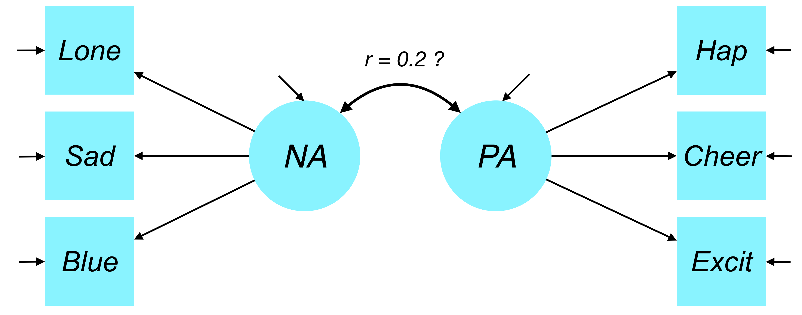
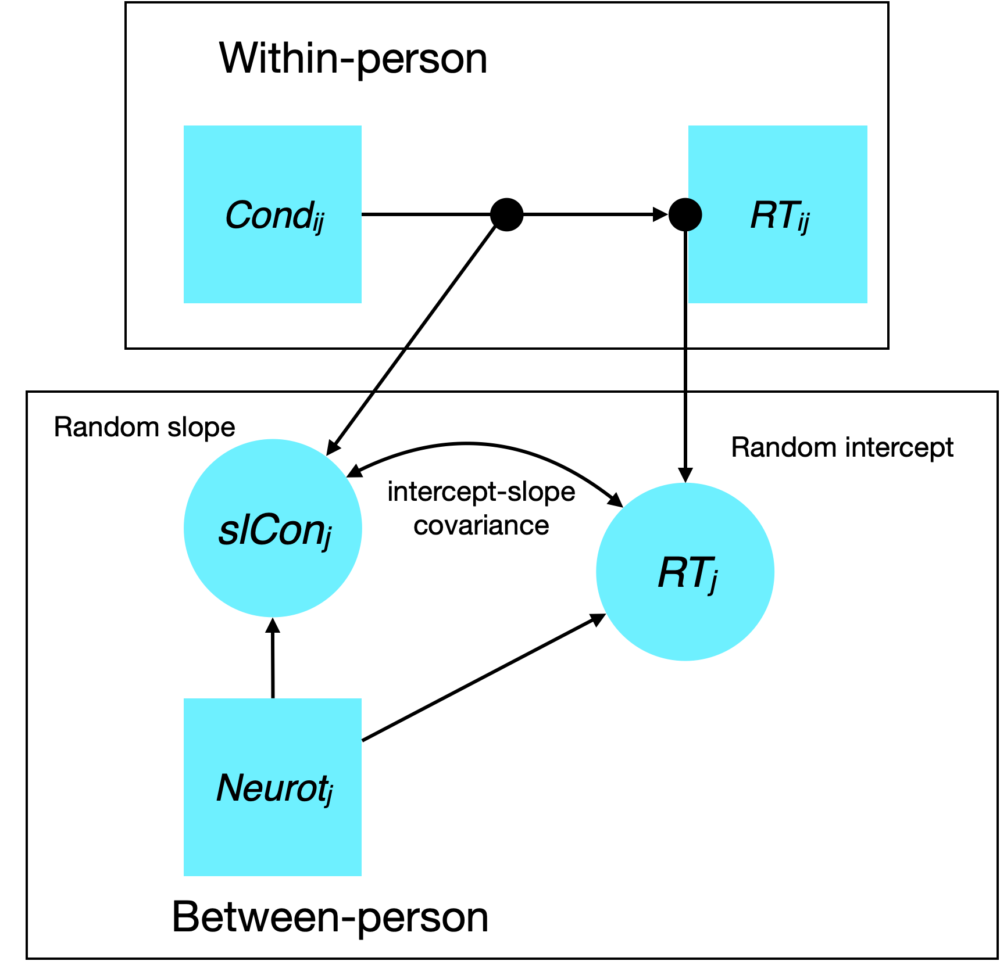

<style type="text/css">
body{ font-size: 24px; max-width: 1600px; margin: auto; padding: 1em; }
code.r{ font-size: 20px; }
p { padding-top: 8px; padding-bottom: 8px; }
pre { font-size: 16px; }
</style>

```{r setup, include=FALSE}
if (!require(pacman)) { install.packages("pacman"); library(pacman) }
p_load(knitr, tidyverse, broom, lme4, modelr, performance, afex, emmeans, cowplot, insight, merTools,
       ggthemes)
knitr::opts_chunk$set(echo = TRUE) #print code by default
options(digits=3, width=100) 

```

# Going further with random slopes

In my experience, people sometimes make the distinction of 'random intercept' versus 'random slope' models. Indeed, as we have seen, these models do differ in terms of allowing for heterogeneity in the per-cluster (per-person) average/intercept versus allowing for between-cluster heterogeneity in the association of a predictor with the outcome.

Importantly, however, there is not a single 'random slope' model. Rather, the effect of any L1 predictor may differ from one L2 unit to the next. Or in the case of experimental data where we have many trials per subject, we can imagine that any within-subjects predictor -- either an experimental factor like incongruent/congruent condition in the flanker or a continuous covariate like instantaneous heart rate -- may have heterogeneous effects on the outcome across people.

As we scale up the number of random slopes in a model, estimation becomes much more difficult and we may see increasing evidence of model nonconvergence. We'll talk about how to address this when we come to model selection.

Briefly, however, 

## R-side versus G-side random effects

How do random effects enter into the model? The math gets a little hairy here, so I'm going to try to keep things at a high level. Briefly, each person (L2 unit) in an MLM has a predicted data variance/covariance matrix $\mathbf{V}_j$ that reflects both unmodeled level 1 residual variability (usually denoted $\sigma^2_e$ or just $\sigma^2$) and unmodeled variability due to individual-specific deviations from the sample average in the random effects (e.g., intercept and one or more slopes). Note the emphasis on *unmodeled* here! The $\mathbf{V}_j$ matrix is capturing the residual structure (both variance and covariance) of a given person (L2 unit) after controlling for all fixed effects in the model.

We have already seen that the random effects in the model are assumed to be distributed as multivariate normal (MVN). Recall our flanker RT analysis example where we allowed a random intercept per subject and a random slope of trial condition (incongruent/congruent):

$$
\begin{bmatrix} 
\mu_{\textrm{int},j} \\ 
\mu_{\textrm{cond},j} 
\end{bmatrix} 
\sim \mathcal{N}(\begin{bmatrix} 0 \\ 0\end{bmatrix}, 
\begin{bmatrix} \tau_{\textrm{int}} & \tau_{\textrm{int,cond}} \\ 
\tau_{\textrm{int,cond}} & \tau_{\textrm{cond}}\end{bmatrix})
$$

As we scale up the number of random effects, the matrix gets bigger. For example, with four random effects, we see:

$$
\begin{bmatrix} 
\mu_{0j} \\ 
\mu_{1j} \\
\mu_{2j} \\
\mu_{3j}
\end{bmatrix} 
\sim \mathcal{N}(\begin{bmatrix} 0 \\ 0 \\ 0 \\ 0 \end{bmatrix}, 
\begin{bmatrix}
\tau_{00} & \tau_{01} & \tau_{02} & \tau_{03} \\ 
\tau_{10} & \tau_{11} & \tau_{12} & \tau_{13} \\
\tau_{20} & \tau_{21} & \tau_{22} & \tau_{23} \\
\tau_{30} & \tau_{31} & \tau_{32} & \tau_{33}
\end{bmatrix})
$$

How does this structure influence the model-predicted variance-covariance matrix for a given person, $\mathbf{V}_j$? Let me start by saying that the variance-covariance matrix of the random effects is called $\mathbf{G}$. When you hear about 'G-side' random effects, this is what people mean. In essence, random effects in $\mathbf{G}$ represent *free parameters* (i.e., estimated by the model) that capture either 1) L2/between-person variability in a given model term (e.g., the slope of a predictor or the intercept) or 2) covariance between a pair of random variances. The diagonal represents variances -- that is, the magnitude of L2 variation in a given predictor in the model. The off-diagonal represents covariances. We'll cover covariances in more detail when we get to correlated versus uncorrelated random effects below.

Okay, now that we know 'G', what does it do? Here's the mathematical answer...

$$
\mathbf{V}_j = \mathbf{Z}_j \mathbf{G}_j \mathbf{Z}_j' + \mathbf{R}_j
$$

Since showing you matrices probably seems an irritation rather than an explanation, let me explain. The first expression $\mathbf{Z}_j \mathbf{G}_j \mathbf{Z}_j'$ captures the contribution of L2 random effects to the total subject-level *residual* variance-covariance, $\mathbf{V}_j$. The second expression, $\mathbf{R}_j$, captures L1 (for us, within-person) residual variability.

$\mathbf{Z}_j$ is an $n_j \times p$ matrix, where $n_j$ is the number of repeated observations for person $j$ and $p$ is the number of predictor variabels that have random effects in the model (e.g., in random intercept models, $p$ is 1). The $\mathbf{Z}_j$ contains the values for person $j$ for the predictors with random effects. For example, if there were a random intercept and a random slope of trial (e.g., 1-5 in a 5-trial experiment):

$$
\mathbf{Z}_j = 
\begin{bmatrix}
1 & 1 \\
1 & 2 \\
1 & 3 \\
1 & 4 \\
1 & 5
\end{bmatrix},
\mathbf{G}_j = 
\begin{bmatrix}
\tau_\textrm{int} & \tau_{\textrm{int}, \textrm{trial}} \\
\tau_{\textrm{int}, \textrm{trial}} & \tau_{\textrm{trial}}
\end{bmatrix}
$$

What would happen if one subject missed trials 2 and 4? Importantly, MLM does not break down due to differential missingness (a relative advantage over ANOVA). Since every person has their own $\mathbf{Z}_j$, it's okay for these to vary by person.

$$
\mathbf{Z}_j = 
\begin{bmatrix}
1 & 1 \\
1 & 3 \\
1 & 5
\end{bmatrix}
$$

Thus, when we pre- and post-multiply $\mathbf{G}_j$ by $\mathbf{Z}_j$ (transposing the second time), we will get an $n_j x n_j$ matrix representing the contribution of random effects to the residual variance-covariance $\mathbf{V}_j$.

What remains is $\mathbf{R}_j$, which captures the effect of L1 residual variability on the residual variance-covariance matrix, $\mathbf{V}_j$. This matrix is what people are talking about when they say 'R-side' random effects. In the simplest case, the $R$ matrix (which encompasses all people/units) reflects the equal contribution of the L1 residual variability term $\sigma^2_e$ to any given observation (essentially the L1 residual).

$$
\mathbf{R}_{N \times N} =  \sigma^2_e \mathbf{I}_{N \times N} =
\begin{bmatrix}
\sigma^2_e & 0 & 0 & ... & 0 \\
0 & \sigma^2_e & 0 & ... & 0 \\
\vdots & & \ddots & & \vdots \\
0 & 0 & 0 & ... & \sigma^2_e
\end{bmatrix}
$$

Here, $\mathbf{I}$ is just the 'identity matrix' (1s on the diagonal, 0s on the off-diagonal), and $N$ is the total number of observations (both within and between subjects).

If we put these pieces together, we get the $\mathbf{V}_j$ matrix. It gets pretty ugly as soon as we go above one random effect, so let me write it out just for the random intercept (single random effect) model. Let's return to the case where we have a person who has five trials in the experiment, so $n_j = 5$.

$$
\mathbf{V}_j = 
\begin{bmatrix}
1  \\
1  \\
1  \\
1  \\
1
\end{bmatrix} 
\begin{bmatrix}
\tau_\textrm{int}
\end{bmatrix}
\begin{bmatrix} 1 & 1 & 1 & 1 & 1 \end{bmatrix} +
\begin{bmatrix}
\sigma^2_e & 0 & 0 & 0 & 0 \\
0 & \sigma^2_e & 0 & 0 & 0 \\
0 & 0 & \sigma^2_e & 0 & 0 \\
0 & 0 & 0 & \sigma^2_e & 0 \\
0 & 0 & 0 & 0 & \sigma^2_e
\end{bmatrix} = \\
\begin{bmatrix}
\sigma^2_e + \tau_\textrm{int} & \tau_\textrm{int} & \tau_\textrm{int} & \tau_\textrm{int} & \tau_\textrm{int} \\
\tau_\textrm{int} & \sigma^2_e + \tau_\textrm{int}& \tau_\textrm{int} & \tau_\textrm{int} & \tau_\textrm{int} \\
\tau_\textrm{int} & \tau_\textrm{int} & \sigma^2_e + \tau_\textrm{int} & \tau_\textrm{int} & \tau_\textrm{int} \\
\tau_\textrm{int} & \tau_\textrm{int} & \tau_\textrm{int} & \sigma^2_e + \tau_\textrm{int} & \tau_\textrm{int} \\
\tau_\textrm{int} & \tau_\textrm{int} & \tau_\textrm{int} & \tau_\textrm{int} & \sigma^2_e
\end{bmatrix} 
$$

Note that in some texts, you'll see $\tau_\textrm{int}$ denoted $\tau^2_{00}$ or $\sigma^2_{\mu0}$. Regardless of the notation, know that this represents a *variance* estimate, not the standard deviation. So perhaps having the square as the exponent is clearer?

What does this say about the structure of the $\mathbf{V}_j$ matrix? First, we see that the residual variance of a given observation is $\sigma^2_e + \tau_\textrm{int}$, which highlights that in a random intercept model, the stochastic/random part of the model consists of both a level 1 (within-person) unmodeled variance $\sigma^2_e$ and a variance that comes from the person (level 2 unit) having a person-specific intercept that differs from the sample average intercept. Second, we see that the residual covariance of any two observations, no matter how far apart they are spaced (here, in terms of trial number), is given by $\tau_\textrm{int}$.

Let's think about this in terms of the predicted scores for a given person $j$. Consider the model where we have an intercept, trial number, and the flanker condition (1 = incongruent, 0 = congruent) as fixed effects and we also include a random intercept and random slope of trial number. This model in R lmer syntax would be:

```
mobj <- lmer(rt_inv ~ 1 + trial + cond + (1 + trial | id), data)
```

The general expression is:

$$
\mathbf{y}_j = (\mathbf{X}_j \cdot \boldsymbol{\gamma}) + 
  (\mathbf{Z}_j \cdot \boldsymbol{\mu}_j + \mathbf{E}_j)
$$
The terms in the first set of parentheses are the *fixed effects* -- we are multiplying this person's scores on all predictors $\mathbf{X}_j$ by the parameters that reflect average effects in the sample $\boldsymbol{\gamma}$. Note the absence of a subscript $j$ for the $\boldsymbol{\gamma}$ -- these are not subject-specific!

The terms in the second set of parentheses are the *random effects*. The term $\mathbf{Z}_j \cdot \boldsymbol{\mu}_j$ reflects the person's scores on all predictors that have random effects in the model multiplied against the person-specific deviations from the sample average effect. This is the effect of G-side random effects on the predicted scores. Remember this equation: $\beta_{0j} = \gamma_{00} + \mu_{0j}$. The person-specific intercept reflects a fixed component (average intercept) and a person-specific deviation from the sample average. Finally, the term $\mathbf{E}_j$ captured residual L1 variability in the scores -- this reflects the R-side random effects.

How does this look for a given person?

$$
\begin{bmatrix}
\textrm{y}_{1j} \\
\textrm{y}_{2j} \\
\textrm{y}_{3j} \\
\textrm{y}_{4j} \\
\textrm{y}_{5j}
\end{bmatrix} = 
\begin{bmatrix}
1 & 0 & 1 \\
1 & 0 & 2 \\
1 & 1 & 3 \\
1 & 1 & 4 \\
1 & 0 & 5
\end{bmatrix}
\begin{bmatrix}
\gamma_{00} \\
\gamma_{10} \\
\gamma_{20}
\end{bmatrix} +
\begin{bmatrix}
1 & 1 \\
1 & 2 \\
1 & 3 \\
1 & 4 \\
1 & 5
\end{bmatrix}
\begin{bmatrix}
\mu_{0j} \\
\mu_{2j}
\end{bmatrix} +
\begin{bmatrix}
\varepsilon_{1j} \\
\varepsilon_{2j} \\
\varepsilon_{3j} \\
\varepsilon_{4j} \\
\varepsilon_{5j}
\end{bmatrix}
$$

## Correlated versus uncorrelated random effects

Up to this point, I have simply said that as we scale up random effects in the G matrix, we increase the number of covariance parameters that are estimated. But we haven't said much about what these mean or whether estimating these covariances is a good idea. To wit:

$$
\begin{bmatrix} 
\mu_{0j} \\ 
\mu_{1j} \\
\mu_{2j}
\end{bmatrix} 
\sim \mathcal{N}(\begin{bmatrix} 0 \\ 0 \\ 0 \end{bmatrix}, 
\begin{bmatrix}
\tau_{00} & \tau_{01} & \tau_{02} \\ 
\tau_{10} & \tau_{11} & \tau_{12} \\
\tau_{20} & \tau_{21} & \tau_{22}
\end{bmatrix})
$$

Here, we have three random effects -- say, a random intercept, a random slope of trial, and a random slope of flanker congruency. The covariance matrix $\mathbf{G}$ has three variances -- $\tau_{00}, \tau_{11}, \tau_{22}$ -- and three covariances -- $\tau_{10}, \tau_{20}, \tau_{21}$. Note that it is a covariance matrix and thus the symmetric off-diagonal elements are the same (covariance is an undirected measure). Thus, $\tau_{01} = \tau_{10}$ and so on. A simpler view might be:

$$
\begin{bmatrix} 
\mu_{0j} \\ 
\mu_{1j} \\
\mu_{2j}
\end{bmatrix} 
\sim \mathcal{N}(\begin{bmatrix} 0 \\ 0 \\ 0 \end{bmatrix}, 
\begin{bmatrix}
\tau_{00} &  &  \\ 
\tau_{10} & \tau_{11} & \\
\tau_{20} & \tau_{21} & \tau_{22}
\end{bmatrix})
$$

What does this structure represent? As usual, the variances represent between-person (between-cluster/L2) variation in the variable tied to each variance component (recall $\mathbf{Z}_j$). In the usual nomenclature, $\tau_{00}$ is between-person variation in the regression intercept, though this is not required. Formally $\tau_{00}$ is just the first random variance component.

As noted above, the off-diagonal elements capture correlations (technically covariances) among the random effects. What do these represent? The covariances in $\mathbf{G}$ capture correlations in between-person differences. This brings me to a very important point: random effects in MLMs represent a kind of *latent variable*. That is, they represent unknown quantities/attributes about the observations that are estimated from the data and have a distributional form (including a variance).

Thus, if you know a little about structural equation modeling, you may be used to thinking about things like this:



Here, our latent variables are negative affect and positive affect. The factors have variances (just like MLM random effects!) and the observed variables have residuals (represented by the 'disturbances'). We might also want to know: how correlated are negative affect and positive affect with each other, which is represented by their *covariance*.

Let's think back to our flanker example:



The idea is that each individual has a person-specific intercept, capturing their mean RT when all predictors are 0, and a person-specific association between trial incongruency and RT, capturing how much the person tends to slow down for incongruent compared to congruent trials.

Just like in our personality SEM model, we consider the possibility of correlations in these person-specific effects (often conceptualized as factor scores in SEM). For example, what if people who are slower on average (random intercept) also have a *smaller* effect of incongruency because they're already at a kind of ceiling in RT? Then we would expect the covariance of $\tau_{10}$ (intercept, cond) to be negative.

On the other hand, if people who are slower on average have even large differential effects of incongruency (suggesting overall slow processing of the demands of the task) then we may see a positive intercept-condition correlation. This is the essence of what correlations among G-side random effects represent.

### Uncorrelated
(aka variance components or VC)

We can also test the account that there is meaningful between-person variation in multiple predictors in the model (e.g., the intercept and two slopes), but that there is no covariance among the random effects. This structure is often called 'uncorrelated' or 'variance components'. It looks like this:

$$
\begin{bmatrix} 
\mu_{0j} \\ 
\mu_{1j} \\
\mu_{2j}
\end{bmatrix} 
\sim \mathcal{N}(\begin{bmatrix} 0 \\ 0 \\ 0 \end{bmatrix}, 
\begin{bmatrix}
\tau_{00} &  &  \\ 
0 & \tau_{11} & \\
0 & 0 & \tau_{22}
\end{bmatrix})
$$

Thus, we assume that individual differences in one random effect do not relate to another random effect. For example, we might say that a person's RT intercept in the flanker is unrelated to how much they slow down to incongruent vs. congruent trials (random slope).

Importantly, the $\mathbf{R}$ matrix is typically parameterized as an uncorrelated structure in MLM:

$$
\mathbf{R} =  
\begin{bmatrix}
\sigma^2_e & 0 & 0 & ... & 0 \\
0 & \sigma^2_e & 0 & ... & 0 \\
\vdots & & \ddots & & \vdots \\
0 & 0 & 0 & ... & \sigma^2_e
\end{bmatrix}
$$

My point here is that we may have different variances and covariances in $\mathbf{G}$ and $\mathbf{R}$ and the form of these matrices should follow our hypotheses about what gives rise to within-person dependency (in the residuals) and between-person dependency (in the random effects).

### Correlated
(aka unstructured)

The alternative to an uncorrelated structure is a correlated one, which we have already seen.

$$
\mathbf{G}_j = 
\begin{bmatrix}
\tau_\textrm{int} & \tau_{\textrm{int}, \textrm{trial}} \\
\tau_{\textrm{int}, \textrm{trial}} & \tau_{\textrm{trial}}
\end{bmatrix}
$$

This matrix form on the G-side also goes by the name of 'unstructured.' Note that it is possible for the R-side matrix to also take this form, though it can lead to a huge number of covariances to be estimated!

$$
\mathbf{R} =  
\begin{bmatrix}
\sigma^2_e & \sigma_{12} & \sigma_{13} \\
\sigma_{12} & \sigma^2_e & \sigma_{23} \\
\sigma_{13} & \sigma_{23} & \sigma^2_e
\end{bmatrix}
$$

## Alternative L1 residual covariance structures

Okay, now that we have this complexity under our belts, how does it relate back to flexibility in how we conceptualize and specify our models? Let's start with the observation that the random intercept model above gave rise to residual variance in scores that was homogeneous within and between persons, $\sigma^2_e + \tau_\textrm{int}$. And the residual covariance of any two observations within-person (i.e., level 1) is given by $\tau_\textrm{int}$.

This structure is often called 'compound symmetry' (aka 'CS') because it treats the residual association of measurements on any two occasions (here, I'm thinking of measures nested within person, where person is the L2 unit) as equal. There is a large family of alternative covariance structures that are more flexible in capturing residual covariance patterns.

[Move to HDFS tutorial]

## Nested random effects

[Move to vizrandomeffects]

-- 

predictors of random slopes

Once we setup predictors, then move into latent disaggregation