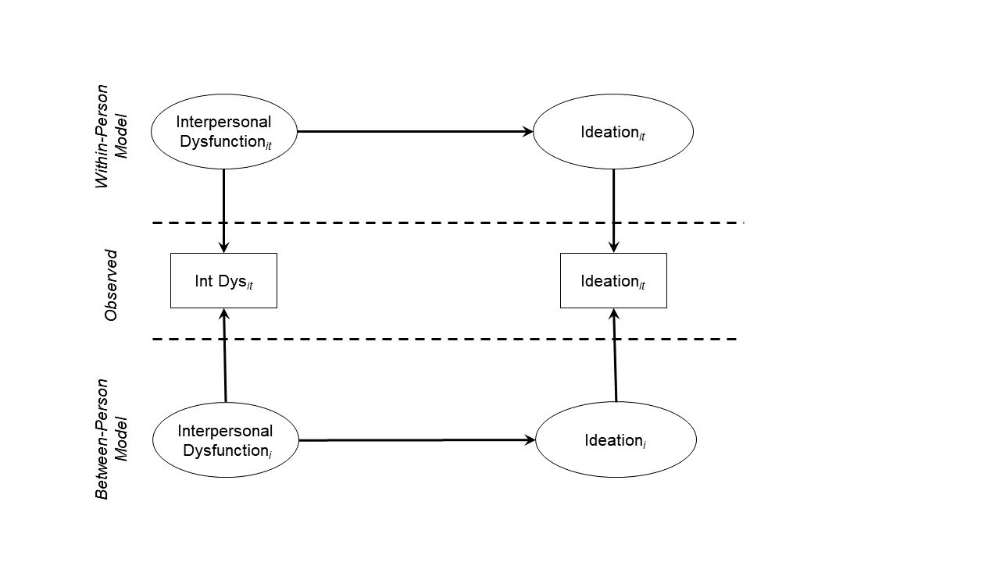
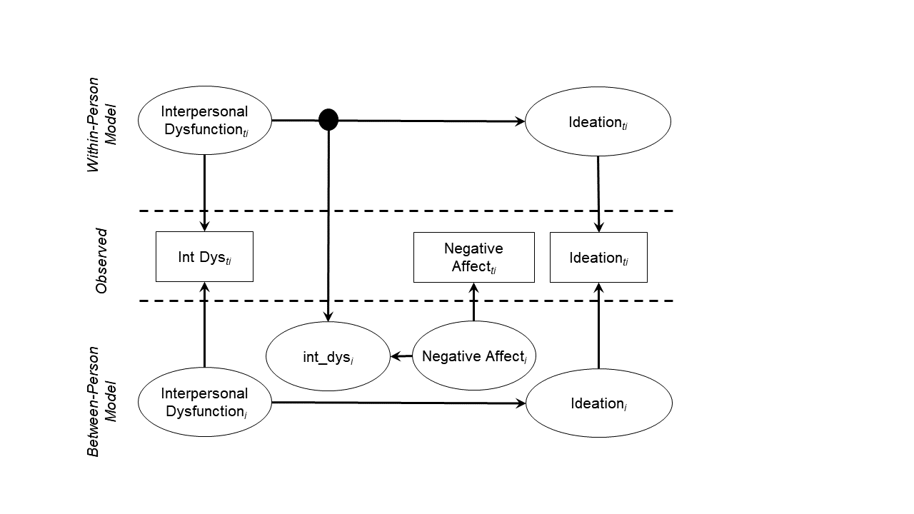
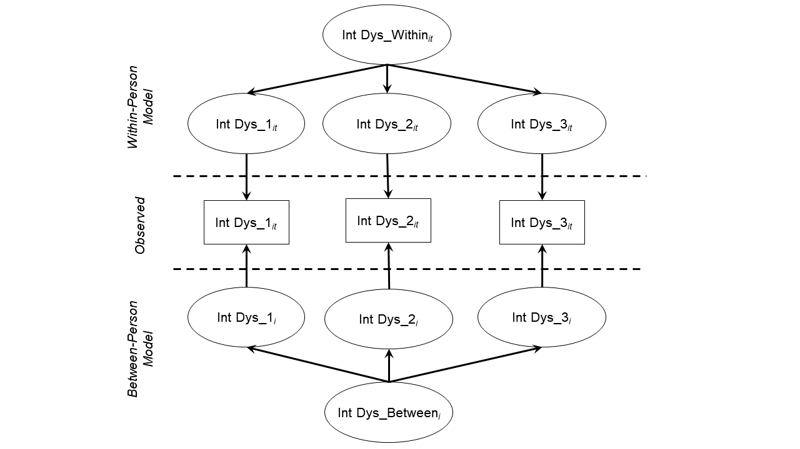
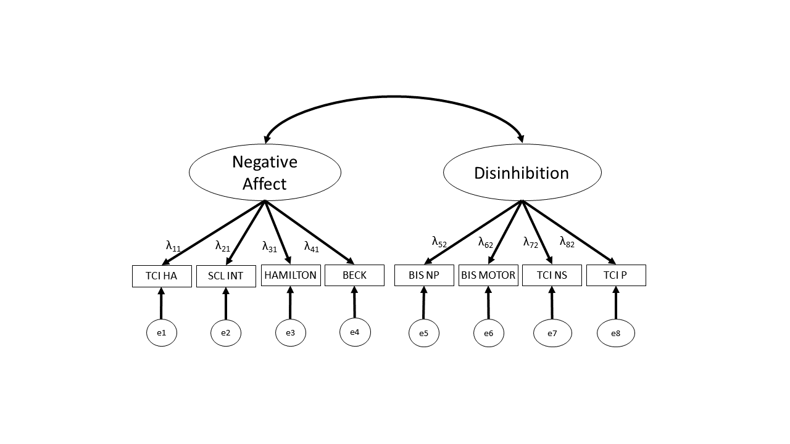
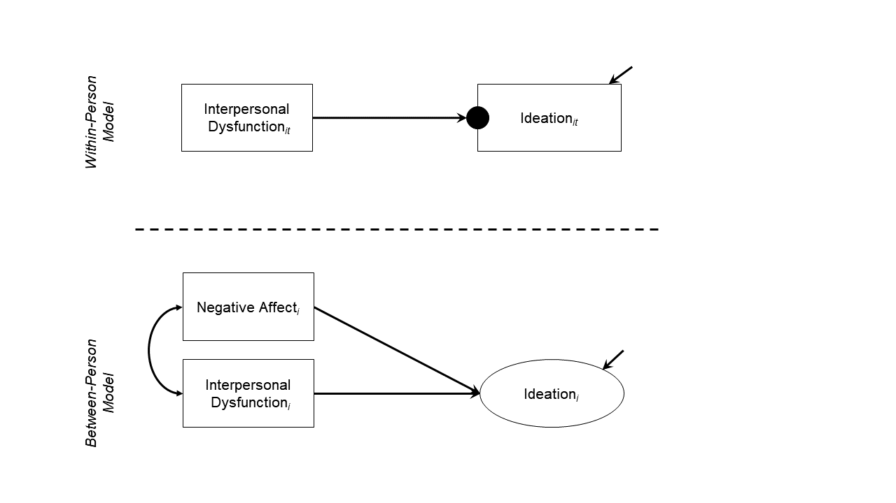
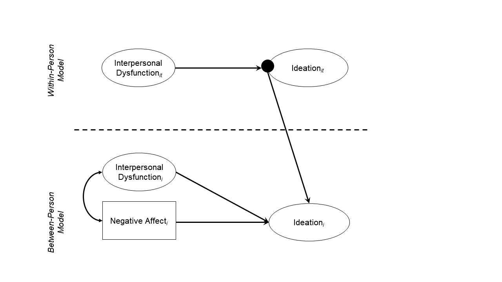
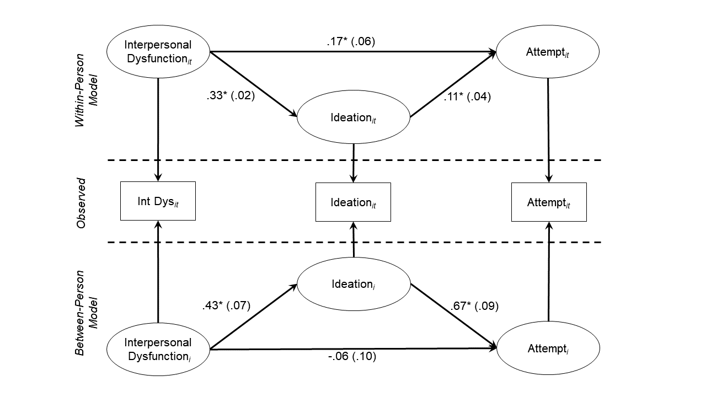
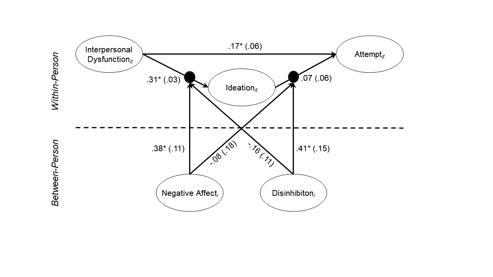

<style type="text/css">
body{ font-size: 20px; max-width: 1800px; margin: auto; padding: 1em; }
code.r{ font-size: 16px; }
p { padding-top: 10px; padding-bottom: 10px; }
pre { font-size: 16px; }
</style>

Note that this `Rmd` file depends on having `Mplus` installed. You can obtain a fully functioning student version for $350 here: https://www.statmodel.com/orderonline/categories.php?category=Mplus-Software/Student-Pricing. 

Or you can use the demo version for free here: https://www.statmodel.com/demo.shtml

The demo version has the following constraints:

1.  Maximum number of dependent variables: 6
2.  Maximum number of independent variables: 2
3.  Maximum number of between variables in two-level analysis: 2
4.  Maximum number of continuous latent variables in time series analysis: 2

MSEM can also be conducted in `lavaan` in R, but its capabilities are still limited. Currently, you can fit a two-level SEM with random intercepts (only when all data is continuous and complete; listwise deletion is used for cases with missing values). You can see more here: https://lavaan.ugent.be/tutorial/multilevel.html

`Mplus` is probably the most user-friendly program for multilevel SEM, though there is similar functionality in EQS and LISREL. In addition, the `OpenMx` package in `R` is free and supports multilevel analyses, but requires a substantially different approach to syntax and specification.

This RMarkdown also leverages a package called `MplusAutomation`, which allows for effective cross-talk between `Mplus` and `R`. In particular, `Mplus` outputs all information into a text-based file, which makes it difficult to compare outputs across models or to extract specific subsections. If you're interested in how this package works, please see [Hallquist and Wiley](http://dependpsu.weebly.com/uploads/6/4/4/5/64458901/hallquist-wiley_mplusautomation_manuscript_sem_accepted_oct2017.pdf) (in press), *Structural Equation Modeling*.

```{r setup, include=FALSE}
if (!require(pacman)) { install.packages("pacman"); library(pacman) }
p_load(knitr, MASS, tidyverse, lavaan, modelr, semPlot, semTools, DiagrammeR, MplusAutomation, texreg, lme4)
knitr::opts_chunk$set(echo = TRUE) #print code by default
options(digits=3)
options(width = 200)
knitr::opts_chunk$set(tidy.opts=list(width.cutoff=180),tidy=TRUE)
set.seed(15092) #to make simulated data the same across computers

#small function to plot all SEM diagrams using
semPaths_default <- function(lavObject, sizeMan=15, ...) {
  require(semPlot)
  semPaths(lavObject, nCharNodes = 0, sizeMan=sizeMan, sizeMan2=4, sizeLat = 13, sizeLat2=7, ...)
}

#Where the mplus binary lives on my computer. Only needed if installed in a non-standard location.
mbin <- "C:/ProgramData/Microsoft/Windows/Start Menu/Programs/Mplus/"
```

# What is multilevel analysis?

In the standard general linear model (GLM), we assume that observations are independent of each other. In particular, we assume that the residuals are distributed iid (indpendently and identically distributed) normal:

$$
\begin{align*}
Y &= B_0 + B_1 X_1 + B_2 X_2 + ... B_p X_p + \varepsilon \\
\varepsilon &\sim \mathcal{N}(0, \sigma^2)
\end{align*}
$$

We know from previous sessions that the assumption of independence is violated when: there are multiple observations per person (e.g., longitudinal data) or there are known clusters in the data that introduce similarity among observations within the clusters. 

## L1 versus L2 effects

Multilevel analysis also allows us to ask specific questions at each level of the model. Today, we will look at how we can do this using a longitudinal dataset of individuals diagnosed with BPD who were followed at annual assessments for up to 30 years. Participants completed a variety of assessments measuring personality & pyschopathology at baseline. At each annual visit, they reported on recent interpersonal functioning, suicidal ideation, and any suicide attempts since their last visit. In this case, annual visits (L1) are nested within participants (L2), and predictors at either L1 or L2 could affect the outcome of interest. At the participant level (L2), we might hypothesize that certain traits, like negative affectivity, influence an outcome of interest (e.g., suicidal ideation). By definition, trait scores are only meaningful as an L2 variable-- they were only measured at baseline, and are presumed (in this study at least) to be stable over time. So if we take ideation as our dependent variable, the data might look like this:

```{r}
tt <- dplyr::tribble(
~year, ~participant, ~negative_affect, ~ideation_score,
1, "JohnID", 4.5, 8,
2, "JohnID", 4.5, 7,
3, "JohnID", 4.5, 9,
1, "SarahID", 2.1, 4,
2, "SarahID", 2.1, 4,
3, "SarahID", 2.1, 2
)

kable(tt)
```

Notice that there is no yearly variation in  `negative affect`. This is the simplest case for a predictor because there is no concern that it could represent a mixture of L1 and L2 effects. That is, negative affect cannot predict any L1 variance (in this case, year-to-year fluctuation) in the DV.

We wish to predict the severity of suicidal ideation in year *i* for person *j* as a function of their negative affect (note, sometimes you will see different subscripts when person is the L2 variable. Often, you will time *t* nested within person *i*. The models however, are the same). Some notation:

$$
\begin{align*}
\textrm{ideation}_{ij} &= \beta_{0j} + r_{ij} \\
\beta_{0j} &= \gamma_{00} + \gamma_{01} \textrm{negative_affect}_j + \mu_{0j} \\
\end{align*}
$$
In this notation, $\gamma_{01}$ represents the person-level effect of negative affect on suicidal ideation. We also allow for there to be normally distributed person-level variation in ideation, $\mu_{0j}$ around the sample average $\gamma_{00}$. To keep the $\beta_{0j}$ equation easy to interpret, L2 predictors are typically centered around the grand mean. This ensures that $\gamma_{00}$ retains the interpretation of the average ideation in the sample (fixed effect), and $\mu_{0j}$ is person-level variation around this mean (random effect).

Variables measured on a more frequent basis -- in this case, at each annual assessment wave -- might also have explanatory value in predicting ideation. For example, we might ask: does year-to-year fluctuation in interpersonal functioning influence suicidal ideation? In this case, interpersonal dysfunction would be an L1 predictor because it was measured at each wave, and varies on a yearly basis. 

## Disaggregating within- versus between-cluster effects

Importantly, the association between an L1 predictor and the outcome could reflect either L1 or L2 variability. Perhaps participants report higher ideation because they recently went through a break up and have experienced a lot of interpersonal problems in the last year (L1). But some participants may simply experience more interpersonal dysfunction on average, which may also drive higher average ideation (L2).

Because interpersonal dysfunction is an L1 variable, it may have systematic variation at both the year (L1) and participant (L2) level. In conventional multilevel modeling (MLM), one can disentangle the variance at each level using centering (Curran & Bauer, 2011). The usual approach is to center the predictor (interpersonal dysfunction) around the participant mean such that we now have a variable that represents yearly deviation in interpersonal dysfunction relative to the participant's average across all waves (this is often called group-mean centering). Then, we also compute the average interpersonal dysfunction for each participant across all waves and include that as a predictor at L2 (this is grand-mean centered). In this way, we can examine whether a participant's average interpersonal dysfunction predicts their average suicidal ideation (an L2 effect). Likewise, the effect of yearly variation in interpersonal dysfunction that is not explainable by the person's average levels can also be examined.

Here, we add interpersonal dysfunction at L1 only: 

$$
\begin{align*}
\textrm{ideation}_{ij} &= \beta_{0j} + \beta_{1j} \textrm{int_dys}_{ij} + r_{ij} \\
\beta_{0j} &= \gamma_{00} + \gamma_{01} \textrm{negative_affect}_j + \mu_{0j} \\
\beta_{1j} &= \gamma_{10} + \mu_{1j}
\end{align*}
$$

The major difficulty of this representation is that $\textrm{int_dys}_{ij}$ may have variation both within-person (from year-to-year) and between-person (on average). Thus, the main coefficient of interest for this predictor, $\gamma_{10}$, (fixed effect) is an unknown combination of L1 and L2 variability. Here, we add a random slope to allow for the association of interpersonal dysfunction with ideation to vary randomly by person, $\mu_{1j}$.

As mentioned above, to handle the problem of $\textrm{int_dys}$ potentially having variation at L1 and L2, we apply the L1 centering + L2 means approach.

The notation for the person-centered interpersonal dysfunction is:

$$
\dot{\textrm{int_dys}_{ij}} = \textrm{int_dys}_{ij} - \bar{\textrm{int_dys}_{j}}
$$

That is, we subtract the average interpersonal dysfunction for a participant across all waves, $\bar{\textrm{int_dys}_{j}}$, from the interpersonal dysfunction that they report in each year.

We then introduce both of these new variables into the model:

$$
\begin{align*}
\textrm{ideation}_{ij} &= \beta_{0j} + \beta_{1j} \dot{\textrm{int_dys}_{ij}} + r_{ij} \\
\beta_{0j} &= \gamma_{00} + \gamma_{01} \textrm{negative_affect}_j + \gamma_{02} \bar{\textrm{int_dys}_{j}} + \mu_{0j} \\
\beta_{1j} &= \gamma_{10} + \mu_{1j}
\end{align*}
$$

Thus, average interpersonal dysfunction for each person  predicts average variation in ideation (this is a between-person effect). The difference between one's intepersonal dysfunction in a given year and their average interpersonal dysfunction represents the yearly effect of int_dys on ideation (a within-person effect). 

This is perhaps more evident in the combined equation:

$$
\textrm{ideation}_{ij} = ( \gamma_{00} + \gamma_{01} \textrm{negative_affect}_j +
\gamma_{02} \bar{\textrm{int_dys}_{j}} +
\gamma_{10} \dot{\textrm{int_dys}_{ij}} ) + \\
( r_{ij} + \mu_{0j} + \mu_{1j} \dot{\textrm{int_dys}_{ij}} )
$$
Note how $\textrm{int_dys}$ enters the model in two ways (year and person level). As in previous examples, the fixed effects are denoted in the first set of parentheses, and the random effects in the second.

# Multilevel SEM (MSEM) overview

Okay, so we've actually seen most of this from previous lectures. Where does SEM enter the picture? In multilevel SEM, we use a latent variable approach to parcellate variation between and within clusters, rather than applying a cluster-based centering approach. This is the intuition:



Latent variables, which are depicted in circles above, are variables for which we have no direct measurement within our dataset. For example, we may measure interpersonal dysfunction at each wave, but the scores on that measure are neither a pure indicator of within-person interpersonal dysfunction, nor a pure indicator of between-person interpersonal dysfunction. Instead, scores are likely a function of both within- and between-person variance (as well as measurement error). By invoking SEM, we are postulating that variance in our observed variable is due to two latent influences: within-person interpersonal dysfunction, and between-person interpersonal dysfunction.

Importantly, this framework also allows for the specification of random slopes such that within-person/cluster variation in the strength of an association between two variables can *itself* be a latent variable at the between-person level. For example, does the within-person association of interpersonal dysfunction with ideation depend on negative affect? Said differently, does negative affect moderate the relationship between interpersonal dysfunction in a given year and ideation in a given year? This is the multilevel SEM equivalent of *cross-level interaction* in MLM. Our graphical notation is as follows:



So far, however, the expression of multilevel data in a SEM framework has not revealed any new capabilities beyond standard MLM. Why would one consider multilevel SEM? A few reasons: 

  1.  As in single-level regression, classic MLM assumes that all predictors are measured without error, which can result in estimation biases (Cole &        Preacher 2014; Ludtke et al., 2008; Westfal & Yarkoni, 2016). Moving to MSEM allows us to specify latent variables that reflect the shared              variance among several indicators of our constructs -- at either level of the model.
  2.  Classic MLMs have only a single outcome, and variables must be designated exclusively as outcomes or predictors. This makes it tricky to look at        things like mediation, where the effect of one variables on another is mediated through a third variable that serves as both predictor and              outcome. For an excellent introduction to the value of SEM for testing multilevel mediation, see Preacher, Zyphur, and Zhang (2010),                    *Psychological Methods*. 
  3.  The standard MLM approach of cluster-mean centering introduces two potentially important biases. Nickell's Bias: in time-series data,                   observed-mean centering can negativley bias lagged effects when few time points are present (e.g., imagine cluster-mean centering with just 2 time       points, the result would be one positive and one negative value, and these would be negatively correlated; latent centering avoids this bias).          Ludtke's Bias: MLMs typically assume observed L2 variables are based on aggregated L1 variables. If the number of observations at L1 is low             though, the L2 measure may be unreliable and biased. In short, the latent decomposition of within-between in MSEM tends to provide better               estimates than the centering method in MLM. 
  4.  As we'll see below. MSEM also allows us to test hypotheses involving *latent* variables, which are hard to implement in standard MLM. 
  5.  Finally, on a more practical level, some people (especially those with a background in SEM) may find it easier to conceptualize of multilevel data       structures and models within the SEM framework where we are used to path diagrams. 

One important thing to note is that while we have the option of using latent decomposition to partition variance in MSEM, we do not have to use it -- we can still employ a conventional centering strategy if we choose (in which case, the present of latent variables at either level is the only thing that makes the model MSEM).

##  A bit about SEM generally

At this point, we have made the case that there are some limitations to classic MLM that could be overcome if we use a latent variable approach to parcellating variance at the between and within-levels. But what are latent variables exactly? Bollen (2002) defines a latent variable as a variable "for which there is no sample realization for at least some observations in a given sample." In other words, a latent variable is any variable for which we have no direct measurement. You can see why this is the case for variables in multilevel data. Returning to our example, we have no way of knowing what variance in the interpersonal dysfunction or suicidal ideation scores we get is due to "within-person" (year-to-year) variability, and which is due to "between-person" variability (individual differences). Since we have no direct measurement of these quantities, we can treat them as latent variables and estimate them, using maximum likelihood or some other estimator (e.g., Bayesian estimation).

Moving to an SEM-framework carries other advantages as well, like allowing us to model latent variables within each level to capture patterns of covariation in our observed indicators. In the example above, if we had several measures of interpersonal dysfunction, we could estimate latent between- and within-person variance components, and further use those latent components to model a latent interpersonal dysfunction variable at each level (or perhaps one level, but not the other, it's up to you!). Here's what this would look like: 



Stepping away from MLM for a moment, let's look very briefly at the roots of SEM so that have a bit more context before transitioning to MSEM. A quick note on SEM notation: Circles represent latent variables. Squares represent observed variables. Single-arrow lines can be interpreted as regression paths. Double-arrow lines can be interpreted as correlations. 

The major goal of SEM is to specify a model covariance between observed variables. We can do this by specifying a hypothesized model about how variables are related to one another, and comparing how closely the model-implied covariance matrix ($\Sigma\hat{(\theta)}$) reproduces the observed covariance matrix $S_{xx}$. In SEM, we specify latent factors that we think account for the covariation among observed indicators in our dataset. For example, we might think that a latent variable, which we can call negative affect, accounts for the shared variance between indicators in our data that measure things like depression or anxiety, whereas another latent variable, which we could call disinhibition, accounts for shared variance in indicators dealing with impulsivity and carelessness. We can partition the variance in each of our indicators into common variance (communality), which reflects the variance the indicator shares with all other indicators, and unique variance (uniqueness), which reflects the variance specific to that indicator, plus any measurement error. 



We can use what is known as the common factor model to represent the relationships between observed variables and latent variables. The CFM postulates that every indicator is a linear function of one or more common factors and one unique factor. Here's what the CFM looks like for each indicator in our model of negative affect and disinhibition: 

$$
\textrm{Y}_{1} =  \lambda_{11}\eta_{1} + \epsilon_{1}\\
\textrm{Y}_{2} =  \lambda_{21}\eta_{1} + \epsilon_{2}\\
\textrm{Y}_{3} =  \lambda_{31}\eta_{1} + \epsilon_{3}\\
\textrm{Y}_{4} =  \lambda_{41}\eta_{1} + \epsilon_{4}\\
\textrm{Y}_{5} =  \lambda_{52}\eta_{2} + \epsilon_{5}\\
\textrm{Y}_{6} =  \lambda_{62}\eta_{2} + \epsilon_{6}\\
\textrm{Y}_{7} =  \lambda_{72}\eta_{2} + \epsilon_{7}\\
\textrm{Y}_{8} =  \lambda_{82}\eta_{2} + \epsilon_{8}\\
$$
where $\textrm{Y}_{i}$ is the *i*th indicator of *p* indicators, $\lambda_{im}$ is a factor loading relating indicator *i* to factor *m*, $eta_{m}$ is the latent factor score, and $\epsilon_{i}$ is variance unique to indicator *i*.

We can generalize the factor model to matrix form: (Note, I'm also including $\boldsymbol{K}\boldsymbol{X}_{i}$ here, which is a matrix of regression coefficients reflecting the influence of any exogenous covariates) 

$$
\textrm{Y} =  \Lambda_{y}\eta + \boldsymbol{K}\boldsymbol{X}_{i} + \epsilon\\
$$

For those of you familiar with this model from exploratory factor analysis, one key difference here is that the researcher specifies the relationships between each indicator and each factor, meaning some elements of the factor loading matrix ($\Lambda_{y}$) will be fixed at 0 (not all indicators will load on all factors). Note that in standard SEM, means are not explicitly apart of the model -- rather, the model is only tasked with reproducing the sample variance-covariance matrix. However, we can add mean structure to the model. In this case, the $\nu$ vector captures the intercept for each indicator. 

# Multilevel SEM specification

The formal specification for a multilevel SEM (Muthén & Asparouhov, 2008) is:

$$
\boldsymbol{Y}_{ij} = \boldsymbol{\nu_j} + \boldsymbol{\Lambda}_j\boldsymbol{\eta}_{ij} + \boldsymbol{K_j}\boldsymbol{X}_{ij} + \boldsymbol{\varepsilon}_{ij}
$$

You can immediately see this almost identical to the non-multilevel SEM. $\boldsymbol{\nu}_j$ captures the intercepts of the variables, but the *j* subscript indicates we are now allowing these to vary by cluster. And as usual, we have factor loadings ($\boldsymbol{\Lambda}_j$), factor scores (\boldsymbol{\eta}_{ij}), and the influence of exogenous covariates $\boldsymbol{X}_{ij}$. The important point is that all of these can potentially vary by cluster. I'll spare you the details on how MSEM parcels the structural and measurement models at the within and between levels... But the MSEM can be estimated using maximum likelihood in the typical fashion, with variance being assigned to the appropriate level by latent variable estimation.

# A bit about Mplus MSEM syntax

Unlike `lavaan`, which is a package for `R` that follows most `R` conventions, Mplus is a standalone program that has its own syntax. Although Mplus cannot compete with the all-purpose functionality of `R` for data management and visualization, Mplus has developed a host of useful features for manipulating data, such as within-cluster centering or computing interaction terms.

The basic paradigm of Mplus is that a model consists of three parts: data, model syntax, and model output. By convention, the raw data are provided as a tab-separated file with no column headers, typically using the extension .dat. The Mplus model syntax has its own conventions, such as the use of `ON` to denote the regression of `Y ON X`. Likewise, `WITH` denotes the undirected (residual) association of `X WITH Y`. And factors are specified using `BY`, as in 'measured by': `F1 BY X1 X2 X3`. Mplus syntax also has major sections that define important components of the model, such as the estimator, what data are categorical, what additional outputs to provide, and so on.

By convention, Mplus syntax files are stored as text with the extension .inp. And the output provided by Mplus is also text, stored as .out. There is an impressive array of information in the output file, but its storage as text makes it time-intensive to sift through each section. This is where the `readModels()` command from `MplusAutomation` can help index a number of output files by storing the information in R-friendly data structures such as lists and data.frames.

In Mplus, we use `TYPE=TWOLEVEL` or `TYPE=THREELEVEL` in the `ANALYSIS` section to specify a multilevel model.

## WITHIN

If a variable is specified as `WITHIN` in the `VARIABLE` section, then it is assumed to vary *only* within clusters and to have no between component. In the latent decomposition, the between component of the variable is zero. Thus, this statement is used when 1) the variable varies at the within-cluster level, and 2) we wish to assign the totality of its variance at the within-cluster level, assuming that there is no between component.

## BETWEEN

If a variable is specified as `BETWEEN` in the `VARIABLE` section, it is a cluster-level variable that has no variation within-cluster. These are typically called L2 variables. For example, negative affect would be a `BETWEEN` variable if we are examining yearly assessment waves nested within individuals (or in an experimental context, trials nested within individuals).

## Neither WITHIN nor BETWEEN

If we do not specify that a variable is `WITHIN` or `BETWEEN` then Mplus will model its variance at both levels. That is, it will use latent decomposition to parcellate the variance into within- and between-cluster variance. At the between-cluster level, this means we are modeling the random intercept of that variable.

# Getting started with MSEM in Mplus

Let's pick up on our example by looking at a simple multilevel model that we could easily have specified in `R` as well. 

## Centering approach to disaggregation



The dot on the $Ideation_{it}$ box denotes a random intercept of ideation. That is, there is between-cluster variation in the average level of ideation that can be modeled at the between level. $Interpersonal Dysfunction_{it}$ is the person-centered L1 predictor. $Interpersonal Dysfunction_{i}$ is the individual's mean on Interpersonal Dysfunction. $Negative Affect$ is a cluster-level observed covariate (i.e., no within variance).
```
TITLE:	this is an example of a two-level 
	regression analysis for a continuous 
	dependent variable with a random intercept and an observed covariate
DATA:	FILE = ex1_data.dat;
VARIABLE:	NAMES = ID idys_pm idys_pc Ideation NA_F;
	WITHIN = idys_pc;
	BETWEEN = NA_F idys_pm;
	CLUSTER = ID;
DEFINE:	CENTER idys_pc (GRANDMEAN);
ANALYSIS:	TYPE = TWOLEVEL;
MODEL:
	%WITHIN%	
	Ideation ON idys_pc;
	%BETWEEN%
	Ideation ON NA_F idys_pm;
```

```{r}
ex_data <- read.table("ex_data.dat", sep = ",", col.names = c("ID", "idys_pm", "idys_pc", "Ideation", "NA_F"))

ex1_mobj <- mplusObject(
  TITLE="this is an example of a two-level 
	  regression analysis for a continuous 
	  dependent variable with a random intercept and an observed covariate",
  VARIABLE="WITHIN = idys_pc;
	  BETWEEN = NA_F idys_pm;
	  CLUSTER = ID;",
  DEFINE = "CENTER idys_pc (GRANDMEAN);",
  ANALYSIS = "TYPE = TWOLEVEL;
    ESTIMATOR=MLR;",
  MODEL = "%WITHIN%	
	  Ideation ON idys_pc;
	  %BETWEEN%
	  Ideation ON NA_F idys_pm;",
  OUTPUT="STDYX RESIDUAL;",
  rdata = ex_data
)

ex1_fit <- mplusModeler(ex1_mobj, modelout = "ex1.inp", run=TRUE, hashfilename = FALSE)
screenreg(ex1_fit$results, single.row=TRUE, summaries = c("AICC", "CFI", "SRMR.Within", "SRMR.Between"))

```

Let's compare that to the `lmer` function in `R`:

```{r}
ex1_lmer <- lmer(Ideation ~ idys_pc + NA_F + idys_pm + (1 | ID), ex_data, REML=FALSE)
summary(ex1_lmer)
```

You can see that the results are essentially identical.

## Latent decomposition approach to disaggregation

Unlike MLM, MSEM also offers the potential to consider variation in an observed variable as joint function of within- and between-cluster latent components. Let's re-run this analysis, using the decomposition approach.



```
TITLE:	this is an example of a two-level 
	regression analysis for a continuous 
	dependent variable with a random intercept and a latent covariate
DATA:	FILE = ex_data.dat;
VARIABLE:	NAMES = ID idys Ideation NA_F;
	BETWEEN = NA_F;
	CLUSTER = ID;
DEFINE: CENTER  (GRANDMEAN);
ANALYSIS:	TYPE = TWOLEVEL;
MODEL:
	%WITHIN%	
	Ideation ON idys (gamma10);
	idys;
	%BETWEEN%
	Ideation ON NA_F 
	idys (gamma01);
MODEL CONSTRAINT:
	NEW(betac);
	betac = gamma01 - gamma10;
```

```{r}
ex2_data <- read.table("ex2_data.dat", sep = ",", col.names = c("ID", "idys", "Ideation", "NA_F"))

ex2_mobj <- mplusObject(
  TITLE="this is an example of a two-level 
	  regression analysis for a continuous 
	  dependent variable with a random intercept and a latent covariate",
  VARIABLE="BETWEEN = NA_F;
	  CLUSTER = ID;",
  DEFINE = "CENTER idys (GRANDMEAN);",
  ANALYSIS = "TYPE = TWOLEVEL;
    ESTIMATOR=MLR;",
  MODEL = "
    %WITHIN%
	    Ideation ON idys (gamma10);
	    idys;
	  %BETWEEN%
	    Ideation ON NA_F 
	         idys (gamma01);",
  OUTPUT="STDYX RESIDUAL;",
  rdata = ex2_data
)

ex2_fit <- mplusModeler(ex2_mobj, modelout = "ex2.inp", run=TRUE, hashfilename = FALSE)
screenreg(ex2_fit$results, single.row=TRUE, type="stdyx", summaries = c("AICC", "CFI", "SRMR.Within", "SRMR.Between"))

```

## Latent Variables as Predictors

As noted earlier, a key feature of MSEM is that we can use latent variables to both 1) better partition variance at the between- and within- person levels, and 2) improve the reliability of our measurement, in the same way that latent variables are employed in standard SEM. Extending this to the current example, we could specify latent variables to represent interpersonal dysfunction (or ideation, if we had the indicators) at both the within- and between-person levels. Here, we use three scales of the Social Adjustment Scale (family/social/work adjustment) as indicators of a latent interpersonal dysfunction variable. (Note, standardized output is not available with MLR in this model, so these are unstandardized results).

```
TITLE:	Same model as previous, but now we use a latent variable to represent Int Dys
DATA:   FILE = ex2a_data.dat;
VARIABLE:	NAMES = ID IDys_Wor IDys_Fam IDys_Soc Ideation NA_F;
	BETWEEN = NA_F;
	CLUSTER = ID;
ANALYSIS:	TYPE = TWOLEVEL RANDOM;
MODEL:
    %WITHIN%	
      idysw BY IDys_Wor IDys_Fam IDys_Soc;
 	    Ideation ON idysw;
	  %BETWEEN%	
	    idysb BY IDys_Wor IDys_Fam IDys_Soc;
	    Ideation ON NA_F idysb;
```

```{r}
ex2a_data <- read.table("ex2a_data.dat", sep = ",", col.names = c("ID", "IDys_Wor", "IDys_Fam", "IDys_Soc", "Ideation", "NA_F"))

ex2a_mobj <- mplusObject(
  TITLE="Same model as previous, but now we use a latent variable to represent Int Dys",
  VARIABLE="BETWEEN = NA_F;
	  CLUSTER = ID;",
  ANALYSIS = "TYPE = TWOLEVEL RANDOM;
    ESTIMATOR=MLR;",
  MODEL = "
    %WITHIN%	
      idysw BY IDys_Wor IDys_Fam IDys_Soc;
 	    Ideation ON idysw;
	  %BETWEEN%	
	    idysb BY IDys_Wor IDys_Fam IDys_Soc;
	    Ideation ON NA_F idysb;
  ",
  OUTPUT="STDYX RESIDUAL;",
  rdata = ex2a_data
)

ex2a_fit <- mplusModeler(ex2a_mobj, modelout = "ex2a.inp", run=TRUE, hashfilename = FALSE)
screenreg(ex2a_fit, single.row=TRUE, summaries = c("AICC", "CFI", "SRMR.Within", "SRMR.Between"))

```

## Random slopes in MSEM

As in standard MLM, we might alternatively expect there to be between-person variation in the strength of an association. For example, does the strength of the within-person association between interpersonal dysfunction and suicidal ideation depend on one's negative affect? In MSEM, we need to specify this as a random slopes that varies at L2. Note, Mplus does not allow full latent decomposition with random slopes using maximum likelihood, so at this point, we need to switch to the Bayesian estimator. In doing so, we will lose some of the traditional fit indices we typically rely on in SEM. Fit indices are provided in the newest version of Mplus for the Bayesian estimator, but even these are not available in MSEM currently. The best advice here is probably to ensure you have a well-fitting model before introducing random slope, and then building from there. 

One other note on random slopes. As mentioned in the Sadikaj et al. chapter, models that include both latent variables and random slopes involving latent variables are especially prone to problems with estimation and convergence. That was the case in this project, where we had to essentially choose between modeling interpersonal dysfunction as a latent variable, or using an observed variable (still with latent decomposition) and being able to specify a random slope. The key difficulty seems to be when using a latent variable within a random slope (so, less likely to see issues when latent variables are in the model, but not used in the random slopes, as you will see in the final example). Here, we return to using the overall score on the SASSR as our interpersonal dysfunction measure, as opposed to specifying a latent variable. 


```
TITLE:	this is an example of a two-level 
	regression analysis for a continuous 
	dependent variable with a random slope and a latent covariate
DATA:   FILE = ex3_data.dat;
VARIABLE:	NAMES = ID idys Ideation NA_F;
	BETWEEN = NA_F;
	CLUSTER = ID;
ANALYSIS:	TYPE = TWOLEVEL RANDOM;
MODEL:
	%WITHIN%	
 	s | Ideation ON idys;	
	%BETWEEN%	
	Ideation s ON NA_F idys;
	Ideation WITH s;
```

```{r}
ex3_data <- read.table("ex3_data.dat", sep = ",", col.names = c("ID", "idys", "Ideation", "NA_F"))

ex3_mobj <- mplusObject(
  TITLE="this is an example of a two-level 
	regression analysis for a continuous 
	dependent variable with a random slope and a latent covariate",
  VARIABLE="BETWEEN = NA_F;
	  CLUSTER = ID;",
  DEFINE = "CENTER idys (GRANDMEAN);",
  ANALYSIS = "TYPE = TWOLEVEL RANDOM;
    ESTIMATOR=BAYES;",
  MODEL = "
    %WITHIN%	
 	    s | Ideation ON idys;
	  %BETWEEN%	
	    Ideation s ON NA_F idys;
	    Ideation WITH s;",
  OUTPUT="STDYX RESIDUAL;",
  rdata = ex3_data
)

ex3_fit <- mplusModeler(ex3_mobj, modelout = "ex3.inp", run=TRUE, hashfilename = FALSE)
screenreg(ex3_fit$results, single.row=TRUE, type = "stdyx")

```

## Time as a Covariate

One important consideration in MSEM models is how to treat time. As noted in the Sadikaj et al. chapter, adding time as a covariate can be useful to account for temporal dependencies in the data. For example, some variables may tend to "go together" more often on weekends than weekdays, or at certain times of the day. Across longer timeframes, as in this study, you might see closer coupling of variables that tap dysfunction in early assessment waves, because people tend to be sampled when they are symptomatic. This coupling may become weaker as participants become less symptomatic. Here, the time variable is labeled `FUY`. We can specify time in the WITHIN statement, since it has no L2 variance (meaning no latent decomposition in this case). Note also that it's important to keep an eye on your sample size as you add and subtract variables in a longitudinal model like this. This is a topic Michael discussed in more detail a few weeks ago. Changing sample sizes may just reflect missing data, but it's nonetheless important you have a sense of how your n is changing in various models (and preferably, to maintain the same n once all variables that you intend to use have been added).


```
TITLE:	this is the same model as in the previous example but adds time (FUY) as a within-person covariate
DATA:   FILE = ex4_data.dat;
VARIABLE:	NAMES = ID FUY idys Ideation NA_F;
  WITHIN = FUY;
	BETWEEN = NA_F;
	CLUSTER = ID;
ANALYSIS:	TYPE = TWOLEVEL RANDOM;
MODEL:
	%WITHIN%	
 	s | Ideation ON idys;	
 	Ideation on FUY;
	%BETWEEN%	
	Ideation s ON NA_F idys;
	Ideation WITH s;
```

```{r}
ex4_data <- read.table("ex4_data.dat", sep = ",", col.names = c("ID", "FUY", "idys", "Ideation", "NA_F"))

ex4_mobj <- mplusObject(
  TITLE="this is the same model as in the previous example but adds time (FUY) as a within-person covariate",
  VARIABLE="BETWEEN = NA_F;
    WITHIN = FUY;
	  CLUSTER = ID;",
  DEFINE = "CENTER idys (GRANDMEAN);",
  ANALYSIS = "TYPE = TWOLEVEL RANDOM;
    ESTIMATOR=BAYES;",
  MODEL = "
    %WITHIN%	
 	    s | Ideation ON idys;
 	    Ideation on FUY;
	  %BETWEEN%	
	    Ideation s ON NA_F idys;
	    Ideation WITH s;",
  OUTPUT="STDYX RESIDUAL;",
  rdata = ex4_data
)

ex4_fit <- mplusModeler(ex4_mobj, modelout = "ex4.inp", run=TRUE, hashfilename = FALSE)
screenreg(ex4_fit$results, single.row=TRUE, type = "stdyx")

```

## Multiple Outcomes and Predictors

A key advantage of MSEM over classic MLM is that variables no longer need to be classified as predictors or outcomes only, and we can have multiple of each in the same model. This opens up a range of new possibilities, including models in which the strength of some within-person process (e.g., the effect of one's perception of other's hostility on their negative affect) predicts a between-person variable (e.g., trait aggression). Likewise, we can consider models in which the effect of one variable on another is mediated by some third variable. This is known as multilevel mediation. We won't have time to delve too deeply into mediation, but the Preacher, Zyphur, and Zhang (2010) paper noted above is the seminal refernece on this topic. 

In our own project, we were interested in whether the effect of interpersonal dysfunction on suicide attempts was mediated by suicidal ideation, at both the within- and between-person levels. In this case, ideation serves as both a predictor (of attempts) and an outcome (predicted by interpersonal dysfunction). Note, attempts is coded 0/1 here (presence/absence in the interval), so we are moving into logistic regression models now. Here's what our model looked like:



## Multilevel Moderated Mediation

You may be wondering what happened to negative affect. Having established that suicidal ideation mediates the links between interpersonal dysfunction and suicide attempts, we can ask whether any between-person variable might moderate these relationships (this is known as multilevel moderated mediation). In this case, we hypothesized that trait negative affect might predict a stronger coupling between interpersonal dysfunction and ideation at the within-person level, and trait disinhibition might predict stronger coupling between ideation and the likelihood of making an attempt. We can model negative affect and disinhibition as latent variables using the same observed indicators as I showed earlier when discussing non-multilevel SEM. Then we can examine whether negative affect predicts the random slope from interpersonal dysfunction to ideation, and whether disinhibition predicts the random slope from ideation to attempts. Here's what the model looked like (note, I exclude the latent decomposition, as well as several covariates in the model, including time, for parsimony): 




# Concluding Thoughts

The recommendations offered by Sadikaj et al. at the end of their chapter provide a nice framework for fitting MSEMs:

  1. Prior to collecting data (or at least analyzing data), the most complex model to be tested should be outlined, and sample size at each level should      be considered carefully (perhaps using simulations as they note). 
  2. Develop your measurement models before moving into MSEM. For example, we fit our CFA models for Negative Affect and Disinhibition outside of a          multilevel context first. Once we had good fitting models, we started to fold them into the MSEM analyses. 
  3. Estimate a fixed effect model first to evaluate model fit at each level. 
  4. Incorporate random effects as relevant. You could compare the fit of your random effects model with your fixed effects model using a LRT or             information criteria. 
  5. Revise model and repeat steps 2-4. 